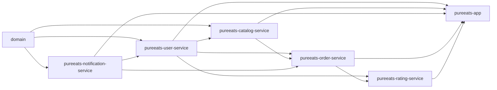
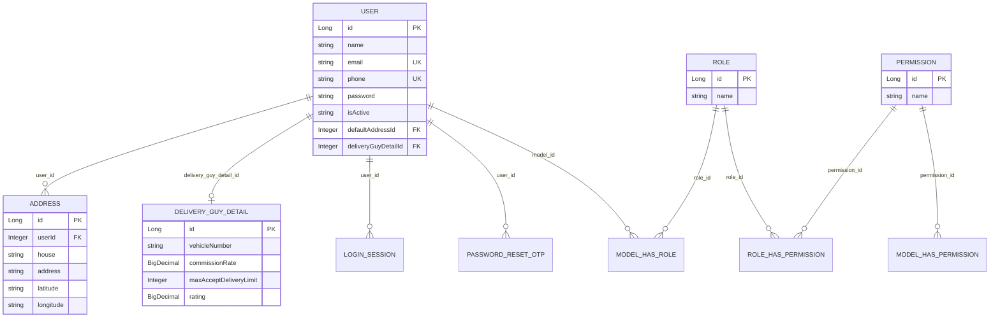
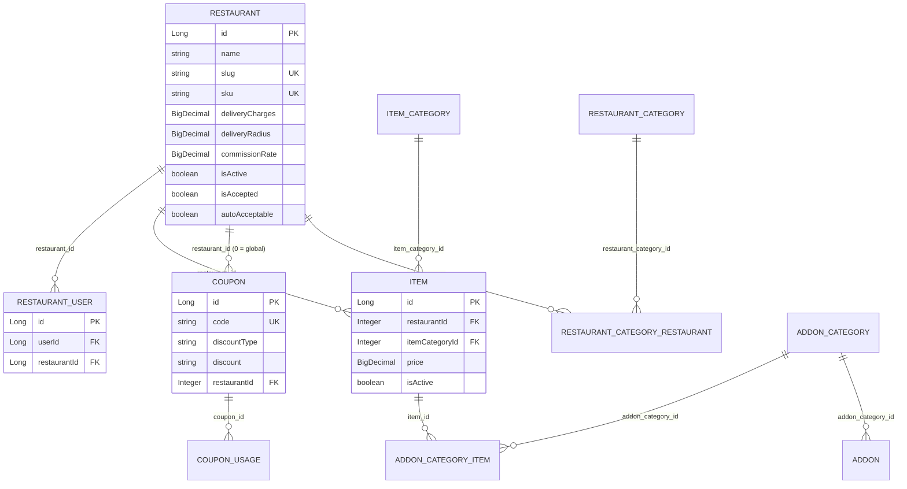
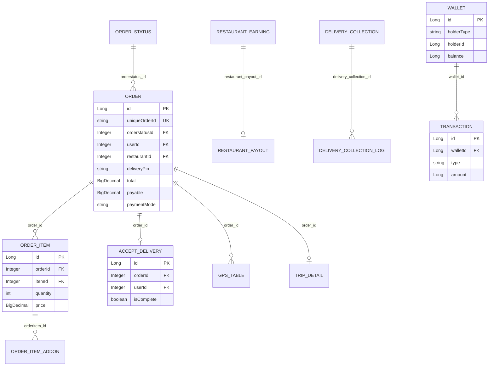
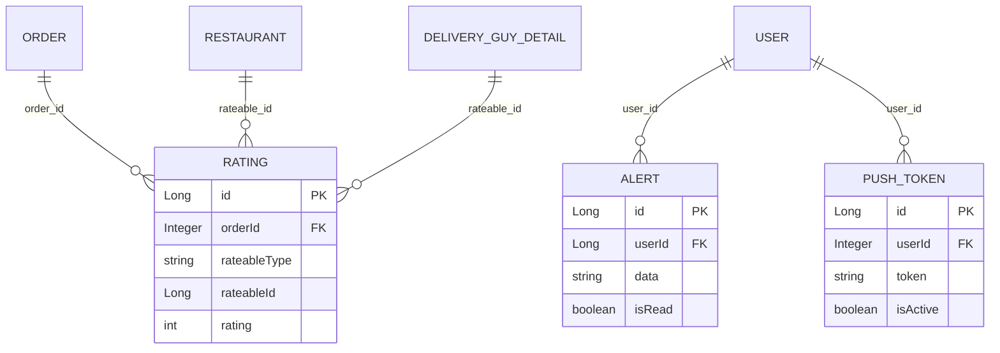

# PureEats — Spring Boot Backend

A multi-module Spring Boot rewrite of the PureEats food-delivery API (originally Laravel). Pure REST API, no server-rendered UI — the [React frontend](../pureeats-react-ui) is the client. Secured with **Spring Security + JWT**, documented with **springdoc-openapi / Swagger UI**, backed by **MySQL**.

```bash
netstat -ano | findstr :8080
taskkill /PID 12456 /F
````

```bash
C:\Program Files\PostgreSQL\18\bin
psql -U postgres -h localhost -p 5432 -d postgres

CREATE DATABASE pureeatsdev;
\c pureeatsdev
```
---

## Table of contents

- [Tech stack](#tech-stack)
- [Module structure](#module-structure)
- [Getting started](#getting-started)
- [Explore the API](#explore-the-api)
- [Security & JWT](#security--jwt)
- [OTP-based auth & security subsystem](#otp-based-auth--security-subsystem)
- [Entity relationships](#entity-relationships)
- [API reference](#api-reference)
- [Configuration reference](#configuration-reference)
- [Known limitations / not yet built](#known-limitations--not-yet-built)

---


## Tech stack

| Concern | Choice |
|---|---|
| Language / runtime | Java 21 |
| Framework | Spring Boot 4.1.1 / Spring Framework 7 |
| Build | Maven (multi-module reactor) |
| Persistence | Spring Data JPA + Hibernate 7, MySQL/MariaDB |
| Security | Spring Security 7, stateless JWT (`jjwt`) |
| API docs | springdoc-openapi (OpenAPI 3 / Swagger UI) |
| Object mapping | Jackson 3 |
| Boilerplate | Lombok |

---

## Module structure

```
pureeats-parent (pom)
├── domain                          entities, enums, exceptions, response envelope — no web/JPA-impl deps
├── pureeats-notification-service   push tokens, in-app alerts, NotificationDispatchService, email/SMS NotificationService
├── pureeats-user-service           auth (password + OTP-challenge), JWT/refresh tokens, users, addresses, rider onboarding, roles, blocklist/rate-limit/audit
├── pureeats-catalog-service        restaurants, menu, addons, coupons, discovery content
├── pureeats-order-service          orders, delivery/rider workflow, wallet, earnings, support tickets
├── pureeats-rating-service         restaurant & driver ratings
└── pureeats-app                    the ONLY runnable module — security config, OpenAPI, application.yml
```

**Dependency graph** (strictly acyclic — each arrow is "depends on"):



**Why this split:**
- `domain` is the shared kernel: every module depends on it, it depends on nothing (no Spring Web/Data — just `jakarta.persistence-api` + Lombok). Holds JPA entities (flat, FK-as-`Long`/`Integer` columns — **no `@ManyToOne`/`@OneToMany`**, deliberately, to avoid cross-module lazy-loading and keep entities framework-light), shared enums (`Role`, `OrderStatusCode`, `DiscountType`, `PaymentMode`, `DeliveryType`, `CommissionBasis`), the `ApiException`/`ApiResponse` envelope, and `CurrentUserContext` (a `ThreadLocal<Long>` set by the JWT filter).
- `pureeats-user-service` owns identity: issuing/validating JWTs, password auth, OTP login, roles (mirrors the legacy Spatie `roles`/`model_has_roles` schema so seeded data keeps working), addresses, rider (`DeliveryGuyDetail`) profiles.
- `pureeats-catalog-service` depends on `user-service` only to call `RoleService.assignRole(...)` when a user registers their first restaurant (grants `STORE_OWNER`).
- `pureeats-order-service` is the busiest module — it depends on `user-service` (addresses, rider limits), `catalog-service` (menu pricing, coupon validation), and `notification-service` (order-event pushes).
- `pureeats-notification-service` depends only on `domain` and sits *below* `pureeats-user-service` (which depends on it for `NotificationService` — OTP email/SMS delivery) — no cycle, since notification-service never needs to know about users/auth. `pureeats-rating-service` stays minimal/independent.
- **Authorization is centralized**, not scattered: `pureeats-app`'s single `SecurityFilterChain` gates URL prefixes by role (`/api/v1/store-owner/**` → `STORE_OWNER`, `/api/v1/delivery/**` → `DELIVERY`, `/api/v1/admin/**` → `ADMIN`). Business modules never need a Spring Security dependency for that — they read `CurrentUserContext.get()` (plain `Long`, no framework needed) or `@AuthenticationPrincipal AuthenticatedUser` for row-level ownership checks (e.g. "does this restaurant belong to this owner").

---

## Explore the API
- Swagger UI: `http://localhost:8080/swagger-ui/index.html`
- OpenAPI JSON: `http://localhost:8080/v3/api-docs`
- Health check: `http://localhost:8080/actuator/health`

Click **Authorize** in Swagger UI and paste a JWT (obtained via `POST /api/v1/auth/register` or `/otp/send` + `/otp/verify` — see [API reference](#api-reference) and [AUTH_SECURITY.md](AUTH_SECURITY.md)) to call protected endpoints.

---

## Getting started

### Prerequisites
- JDK 21, Maven 3.9+, a MySQL/MariaDB instance.

### Build
```bash
mvn -DskipTests clean package
```

### Run
```bash
java -jar pureeats-app/target/pureeats-app-0.0.1-SNAPSHOT.jar
```
Configure via environment variables (see [Configuration reference](#configuration-reference)) — at minimum `DB_NAME`, `DB_USERNAME`, `DB_PASSWORD`, `JWT_SECRET`. On first run, `spring.jpa.hibernate.ddl-auto=update` creates the schema automatically.

### Run from IntelliJ IDEA

Every config value in `application.yml` already has a `${VAR:default}` fallback, so the app boots with zero configuration — but for a real dev run you want your own `DB_NAME`/`JWT_SECRET` rather than the shared placeholders. Set up a Run/Debug Configuration:

1. **Run → Edit Configurations… → + → Application**
2. Main class: `com.pureeats.app.PureEatsApplication`
3. Use classpath of module: `pureeats-app`
4. Paste the following into **VM options** (click "Modify options" → "Add VM options" first if the field isn't shown):

```
-DDB_HOST=localhost -DDB_PORT=3306 -DDB_NAME=pureeats_dev -DDB_USERNAME=root -DDB_PASSWORD= -DJPA_DDL_AUTO=update -DSERVER_PORT=8080 -DJWT_SECRET=local-intellij-dev-secret-key-change-me-min-32-bytes-long -DJWT_EXPIRATION_MS=86400000 -DOTP_DEV_MODE=true -DTAX_PERCENTAGE=5 -DCOMMISSION_BASIS=FULL_ORDER
```

5. Make sure MySQL/MariaDB is running and a database named `pureeats_dev` exists (or change `DB_NAME` above — `ddl-auto=update` creates the tables on first run).

**Alternative**: paste the same values into IntelliJ's separate **Environment variables** field instead (same effect, no `-D`/dashes needed) — use one field or the other, not both:

```
DB_HOST=localhost;DB_PORT=3306;DB_NAME=pureeats_dev;DB_USERNAME=root;DB_PASSWORD=;JPA_DDL_AUTO=update;SERVER_PORT=8080;JWT_SECRET=local-intellij-dev-secret-key-change-me-min-32-bytes-long;JWT_EXPIRATION_MS=86400000;OTP_DEV_MODE=true;TAX_PERCENTAGE=5;COMMISSION_BASIS=FULL_ORDER
```

---

## Security & JWT

- **`/otp/verify`** (`pureeats-user-service`) issues an HS256 JWT containing: `sub` (userId), `name`, `email`, `phone`, `role`, and `deliveryGuyDetailId` (riders only) — enough for the frontend or any internal caller to know "who is this and what can they do" without another API call. There is no password-based login anymore — every account authenticates via OTP (see [AUTH_SECURITY.md](AUTH_SECURITY.md)).
- **Roles**: `SUPER_ADMIN`, `ADMIN`, `STORE_OWNER`, `DELIVERY`, `CUSTOMER`, `EMPLOYEE`. Every self-registered account starts as `CUSTOMER`; registering a restaurant grants `STORE_OWNER`, registering a rider profile grants `DELIVERY`. A user can hold multiple roles simultaneously (mirrors the legacy schema) — the JWT carries the single highest-priority one (`SUPER_ADMIN` > `ADMIN` > `EMPLOYEE` > `STORE_OWNER` > `DELIVERY` > `CUSTOMER`). `/api/v1/admin/**` accepts either `ADMIN` or `SUPER_ADMIN`.
- **`SUPER_ADMIN` and `ADMIN` are never self-registered.** There is exactly one `SUPER_ADMIN` account, created once by `SuperAdminSeeder` (a startup `ApplicationRunner` in `pureeats-user-service`) if none exists yet — see [Configuration reference](#configuration-reference) for its env vars. `POST /auth/register` rejects the call with `403 REGISTRATION_BLOCKED_FOR_PRIVILEGED_ROLE` if the caller's *currently DB-assigned* role (re-checked on every call, not trusted from the JWT claim) is `ADMIN`/`SUPER_ADMIN` — `RoleService.assertCallerNotPrivileged()`. `ADMIN` accounts are meant to be provisioned by a `SUPER_ADMIN` through a future admin panel, not through public signup. Both `SUPER_ADMIN`/`ADMIN` log in the same OTP way as everyone else (via their email).
- **Role changes require re-login** — the JWT is stateless and not re-issued mid-session (e.g. after `POST /api/v1/store-owner/restaurants`, log in again to get a `STORE_OWNER`-role token).
- **Onboarding exception**: `POST /api/v1/store-owner/restaurants` is reachable by *any* authenticated user (not just existing owners), since that's the endpoint that grants the role in the first place — every other `/api/v1/store-owner/**` route requires the role already.
- Stateless sessions, CSRF disabled (no cookies involved), permissive CORS (tighten `SecurityConfig.corsConfigurationSource()` for production).

---

## OTP-based auth & security subsystem

OTP-challenge signup/login (email or phone) is the **only** authentication mechanism in this API —
password-based login/register and the old 4-digit phone-OTP endpoints have been removed entirely.
The flow has a configurable attempt/lock/resend policy, short-lived access tokens + rotating
refresh tokens, device/session tracking, login history with best-effort IP geolocation, an
IP/device/email/phone/user blocklist, DB-backed rate limiting, a pluggable email/SMS notification
abstraction (console by default, Gmail SMTP ready to enable), and an audit log of every
security-relevant event. See **[AUTH_SECURITY.md](AUTH_SECURITY.md)** for the full architecture,
API reference, Gmail setup, and configuration reference.

Endpoints at a glance (all under `/api/v1/auth`, all public except `logout-all`):
`POST /register`, `POST /otp/send`, `POST /otp/verify`, `POST /otp/resend`, `POST /refresh`,
`POST /logout`, `POST /logout-all` 🔒.

---

## Entity relationships

Entities are **flat JPA `@Entity` classes with plain FK-id columns** (`Long`/`Integer`), not `@ManyToOne`/`@OneToMany` associations — this is intentional (see [Module structure](#module-structure)). The diagrams below show the *logical* relationships (matching ID columns), grouped by owning module.

### Identity & users (`pureeats-user-service`)



`ModelHasRole.modelType`/`ModelHasPermission.modelType` store the legacy morph class name `App\User`. `SmsOtp` (phone → OTP, login flow) has no FK — it's looked up by phone number directly.

### Catalog (`pureeats-catalog-service`)



`Location`, `PopularGeoPlace`, `PromoSlider` → `Slide`, `Page`, `Setting`, `PaymentGateway`, `SmsGateway`, `Translation` are standalone reference/content tables (no FKs into the order/catalog graph).

### Orders & delivery (`pureeats-order-service`)



`AcceptDelivery.userId` is the assigned rider's user id. `Wallet.holderType`/`holderId` is a polymorphic FK (only `App\User` holders are used — see `WalletService`); `Wallet.balance`/`Transaction.amount` are integer minor units (paise). `OrderStatusCode` (enum in `domain`) is seeded into `order_statuses` on startup by `OrderStatusSeeder` — `Order.orderstatusId` is always resolved through `OrderStatusService`, never a hardcoded number.

### Ratings & notifications



`Rating.rateableType`/`rateableId` is a polymorphic reference (legacy Laravel morph pattern) — `App\Restaurant` or `App\DeliveryGuyDetail`, resolved via the `RateableType` enum in `pureeats-rating-service`.

---

## API reference

Base path: `/api/v1`. All endpoints return the envelope `{ success, message, data, timestamp }` (see `ApiResponse`). 🔒 = requires `Authorization: Bearer <token>`; role noted where narrower than "any authenticated user".

### Auth — `AuthController`, `PasswordResetController`

There is exactly one authentication mechanism: OTP-challenge (email or phone). Password-based
login/register and the old 4-digit phone-OTP endpoints have been removed — see
[AUTH_SECURITY.md](AUTH_SECURITY.md).

| Method | Path | Auth | Description |
|---|---|---|---|
| POST | `/auth/register` | public | Email signup + verification OTP |
| POST | `/auth/otp/send` | public | Start an OTP-challenge login (phone or email) |
| POST | `/auth/otp/verify` | public | Verify a challenge's OTP → access + refresh token |
| POST | `/auth/otp/resend` | public | Resend the OTP for an existing challenge |
| POST | `/auth/refresh` | public | Exchange (and rotate) a refresh token for a new access token |
| POST | `/auth/logout` | public | Revoke one refresh token / session |
| POST | `/auth/logout-all` | 🔒 | Revoke every session for the current user |

### Admin audit — `AdminAuditController`

Read-only, paginated (`page`/`size`/`sort`) security observability. `ADMIN`/`SUPER_ADMIN` only —
enforced both by the URL rule below and a `@PreAuthorize` on the controller (see
[pureeats-user-service/README.md](pureeats-user-service/README.md#admin-audit-endpoints)).

| Method | Path | Auth | Description |
|---|---|---|---|
| GET | `/admin/audit-logs` | 🔒 admin | Security/activity audit events (filter: `userId`) |
| GET | `/admin/login-history` | 🔒 admin | Login attempts, success and failure (filter: `userId`) |
| GET | `/admin/otp-challenges` | 🔒 admin | OTP challenge lifecycle, never the OTP itself (filter: `userId`) |
| GET | `/admin/rate-limit-buckets` | 🔒 admin | Rate-limit counters |
| GET | `/admin/security-blocklist` | 🔒 admin | IP/device/email/phone/user blocks (filter: `blockType`) |
| GET | `/admin/user-devices` | 🔒 admin | Known devices per user (filter: `userId`) |
| GET | `/admin/user-sessions` | 🔒 admin | Refresh-token sessions, live and revoked (filter: `userId`) |
| POST | `/auth/password/forgot` | public | Send a password-reset code by email — **note:** with password login removed, there is currently no way to actually use a reset password to log in |
| POST | `/auth/password/verify` | public | Verify a password-reset code |
| POST | `/auth/password/reset` | public | Set a new password using a verified code |

### User profile & addresses — `UserController`, `AddressController`, `RiderController`
| Method | Path | Auth | Description |
|---|---|---|---|
| GET | `/users/me` | 🔒 | Get own profile |
| PUT | `/users/me` | 🔒 | Update name/photo |
| GET | `/users/me/addresses` | 🔒 | List saved addresses |
| POST | `/users/me/addresses` | 🔒 | Save a new address |
| PUT | `/users/me/addresses/{id}` | 🔒 | Edit an address |
| DELETE | `/users/me/addresses/{id}` | 🔒 | Delete an address |
| PATCH | `/users/me/addresses/{id}/default` | 🔒 | Set as default address |
| POST | `/users/me/rider-profile` | 🔒 | Register as a delivery rider (grants `DELIVERY`) |
| GET | `/users/me/rider-profile` | 🔒 | Get own rider profile |

### Restaurants & menu — `RestaurantController`, `StoreOwnerRestaurantController`, `StoreOwnerMenuController`, `StoreOwnerAddonController`
| Method | Path | Auth | Description |
|---|---|---|---|
| GET | `/restaurants` | public | List active, accepted restaurants |
| GET | `/restaurants/search?q=` | public | Search restaurants by name |
| GET | `/restaurants/{id}` | public | Restaurant detail by id |
| GET | `/restaurants/slug/{slug}` | public | Restaurant detail by slug |
| GET | `/restaurants/{id}/items` | public | Active menu items |
| POST | `/restaurants/{id}/check-delivery-area` | public | Haversine check: is a lat/long in delivery radius |
| GET | `/store-owner/restaurants` | 🔒 owner | List restaurants you own |
| POST | `/store-owner/restaurants` | 🔒 any | Onboard a new restaurant (grants `STORE_OWNER`) |
| PUT | `/store-owner/restaurants/{id}` | 🔒 owner | Update a restaurant you own |
| PATCH | `/store-owner/restaurants/{id}/enable` \| `/disable` | 🔒 owner | Toggle a restaurant |
| GET / POST | `/store-owner/item-categories` | 🔒 owner | List / create item categories |
| PATCH | `/store-owner/item-categories/{id}/enable` \| `/disable` | 🔒 owner | Toggle a category |
| POST | `/store-owner/restaurants/{restaurantId}/items` | 🔒 owner | Add a menu item |
| PUT | `/store-owner/items/{id}` | 🔒 owner | Update a menu item |
| PATCH | `/store-owner/items/{id}/enable` \| `/disable` | 🔒 owner | Toggle a menu item |
| GET / POST | `/store-owner/addon-categories` | 🔒 owner | List / create addon categories |
| GET | `/store-owner/addon-categories/{id}/addons` | 🔒 owner | List addons in a category |
| POST | `/store-owner/addons` | 🔒 owner | Create an addon |
| PATCH | `/store-owner/addons/{id}/enable` \| `/disable` | 🔒 owner | Toggle an addon |

### Coupons — `CouponController`
| Method | Path | Auth | Description |
|---|---|---|---|
| GET | `/coupons?restaurantId=` | public | List coupons available for a restaurant (incl. global) |
| POST | `/coupons/preview` | 🔒 | Validate a code and preview the discount |
| POST | `/store-owner/coupons` | 🔒 owner | Create a coupon |

### Discovery content — `RestaurantCategoryController`, `LocationController`, `ContentController`
| Method | Path | Auth | Description |
|---|---|---|---|
| GET | `/restaurant-categories` | public | List cuisine/category tags |
| GET | `/restaurant-categories/{id}/restaurants` | public | Restaurants in a category |
| GET | `/locations/search?q=` \| `/popular` \| `/popular-geo-places` | public | Location lookups |
| GET | `/pages` \| `/pages/{slug}` | public | CMS pages |
| GET | `/settings` | public | Public app-settings blob |
| GET | `/promo-sliders` | public | Promo sliders with slides |
| GET | `/languages` | public | Available languages |
| GET | `/payment-gateways` | public | Active payment gateways |

### Orders & delivery — `OrderController`, `StoreOwnerOrderController`, `StoreOwnerEarningsController`, `DeliveryOrderController`, `WalletController`, `SupportController`
| Method | Path | Auth | Description |
|---|---|---|---|
| POST | `/orders` | 🔒 | Place an order |
| GET | `/orders` | 🔒 | List own orders |
| GET | `/orders/{id}` | 🔒 | Order detail |
| PATCH | `/orders/{id}/cancel` | 🔒 | Cancel an order |
| GET | `/store-owner/restaurants/{rid}/orders/new` \| `/running` | 🔒 owner | Order queues |
| POST | `.../orders/{id}/accept` \| `/ready` \| `/self-pickup-complete` \| `/cancel` | 🔒 owner | Order workflow |
| GET | `/store-owner/restaurants/{rid}/earnings` | 🔒 owner | Unsettled earnings |
| POST | `/store-owner/restaurants/{rid}/earnings/payout-request` | 🔒 owner | Request payout |
| GET | `/delivery/orders/available` | 🔒 rider | Orders available to deliver |
| POST | `/delivery/orders/{id}/accept` \| `/pickup` \| `/deliver` | 🔒 rider | Delivery workflow (deliver requires the customer's PIN) |
| POST | `/delivery/gps` | 🔒 rider | Report current GPS location |
| GET | `/delivery/orders/{id}/gps` | 🔒 | Last known rider location |
| GET | `/users/me/wallet` \| `/wallet/transactions` | 🔒 | Wallet balance / ledger |
| POST | `/support` | 🔒 | Raise a support ticket |
| GET | `/support` | 🔒 | List own tickets |

### Ratings & notifications — `RatingController`, `NotificationController`
| Method | Path | Auth | Description |
|---|---|---|---|
| GET | `/ratings/ratable-orders` | 🔒 | Delivered orders still unrated |
| POST | `/ratings` | 🔒 | Submit a restaurant or driver rating |
| GET | `/ratings/restaurants/{id}` \| `/average` | public | Restaurant ratings |
| GET | `/ratings/drivers/{id}` \| `/average` | public | Driver ratings |
| POST | `/notifications/push-token` | 🔒 | Register/refresh a push token |
| GET | `/notifications` | 🔒 | Recent notifications (7 days, max 20) |
| PATCH | `/notifications/read-all` \| `/{id}/read` | 🔒 | Mark notifications read |

---

## Configuration reference

All in `pureeats-app/src/main/resources/application.yml`, overridable via environment variable:

| Env var | Default | Purpose |
|---|---|---|
| `DB_HOST` | `localhost` | MySQL host |
| `DB_PORT` | `3306` | MySQL port |
| `DB_NAME` | `pureeats` | Database name |
| `DB_USERNAME` | `root` | DB user |
| `DB_PASSWORD` | *(empty)* | DB password |
| `JPA_DDL_AUTO` | `update` | Hibernate schema strategy (`validate`/`none` for production) |
| `SERVER_PORT` | `8080` | HTTP port |
| `JWT_SECRET` | dev placeholder | **Must override in production** — HS256 key, 32+ bytes |
| `JWT_EXPIRATION_MS` | `86400000` (24h) | JWT lifetime |
| `OTP_DEV_MODE` | `true` | When true, generated OTP/reset codes are returned in the API response (no SMS/email gateway wired up yet) — **set false once one is** |
| `TAX_PERCENTAGE` | `5` | Flat tax % applied at order placement |
| `COMMISSION_BASIS` | `FULL_ORDER` | `FULL_ORDER` or `DELIVERY_CHARGE_ONLY` — what a rider's commission % is applied against |
| `SUPER_ADMIN_NAME` | `Super Admin` | Display name for the one seeded `SUPER_ADMIN` account |
| `SUPER_ADMIN_EMAIL` | `superadmin@pureeats.local` | Login email for the seeded `SUPER_ADMIN` account |
| `SUPER_ADMIN_PASSWORD` | dev placeholder | **Must override before any shared deployment** — password for the seeded `SUPER_ADMIN` account |

**OTP auth, notification, rate-limit, blocklist and geolocation config** (`security.*`/`notification.*`/`spring.mail.*`) has its own full env-var table in **[AUTH_SECURITY.md → Environment variables](AUTH_SECURITY.md#environment-variables)**.

---

## Known limitations / not yet built

Flagged deliberately (need external credentials or product decisions only you can make):

- **Admin panel/APIs** — `/api/v1/admin/**` now has a first tenant: `AdminAuditController` (read-only security/audit views, see [API reference](#api-reference)). Everything else under the prefix (restaurant/order/user management, etc.) is still unbuilt. Promoting a user to `ADMIN` currently means assigning the role directly in the database; there's no self-serve or admin-panel path for it (deliberately — see [Security & JWT](#security--jwt)).
- **Real payment gateways** — Razorpay/Paytm/PayUmoney/MercadoPago are not integrated; `/payment-gateways` only lists configured rows, COD/WALLET are the only payment modes actually processed.
- **SMS/email delivery** — the OTP-challenge flow (see [AUTH_SECURITY.md](AUTH_SECURITY.md)) has a real, pluggable delivery path (Gmail SMTP ready via config; SMS still needs a real gateway credential wired into the existing `SmsProvider` interface) but ships with console-only providers until you configure one. `PasswordResetController`'s codes are still generated/stored only, returned directly in the response while `OTP_DEV_MODE=true` — and since password-based login has been removed, a reset password currently has no way to be used to log in.
- **Bulk upload, geocoder integration, `Translation`/`SmsGateway` admin CRUD** — entities exist in `domain`, no service/controller layer yet.
- **Delivery-charge tiering** — uses a flat `Restaurant.deliveryCharges`, not the legacy distance-tiered calculation.
