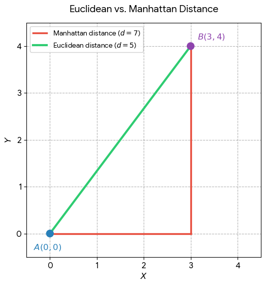

# Location-Based Database System
A complete guide to building and understanding a Location-Based Database System used in applications like:
- Ride-sharing apps
- Food delivery systems
- Maps & navigation
- Nearby search
- GIS platforms
- Real-time driver tracking

When a user searches for nearby stores or places an order, the system must:
- distanceInKm
- nearBy (Finds nearby Stores / Finds nearby drivers)

---

# Table of Contents
1. [Common Geo Queries](#common-geo-queries)
2. [How Location Search Works Internally](#how-location-search-works-internally)
3. [Core Concepts](#core-concepts)
4. [Popular Technologies](#popular-technologies)
Phase 1 — Distance Calculation
Phase 2 — Radius Search
Phase 4 — Bounding Box Optimization
Phase 5 — Spatial Indexing
Phase 6 — GeoHash Indexing
Phase 7 — KD-Tree
Phase 8 — Persistence
Phase 9 — Concurrency
Phase 10 — Production Features
Recommended Learning Path


---

# 1. Common Geo Queries
1. Distance Query (Find locations within a radius)
   - Find restaurants within 2 km
   - Find shops within 5 km
2. Nearest Neighbor Query (Find the closest object.)
   - Find nearest hospital
   - Find nearest driver
3. Polygon Query (Search inside a custom boundary.)
    - Users inside delivery zone
    - Find users inside city boundary
    - Find houses inside polygon area
4. Nearby Search
   - Show all drivers near me
5. Route / Path Query (Find the best path between locations.)
    - Shortest road path from A to B

---

# 2. How Location Search Works Internally

Traditional database indexes like **B-Tree** are inefficient for geographical queries.

Geospatial systems use specialized spatial indexes such as:

* R-Tree
* QuadTree
* KD-Tree
* GeoHash
* S2 Geometry
* H3 Hexagonal Indexing

These systems partition Earth into searchable regions for efficient querying.

---

# 3. Core Concepts

---

# Popular Technologies

# SQL Databases

## PostgreSQL + PostGIS

Supports:

* Distance queries
* Polygon search
* Nearest neighbor search
* GIS operations

### Example Query

```sql
SELECT *
FROM shops
WHERE ST_DWithin(
    location,
    ST_MakePoint(78.48, 17.38)::geography,
    5000
);
```

---

## MySQL Spatial

Provides spatial indexing and geo operations.

---

# NoSQL / Search Engines

## Elasticsearch

Supports fast geo-distance queries and geo aggregations.

---

## MongoDB

Supports:

* 2D indexes
* 2DSphere indexes
* Radius search
* Polygon search

---

## Google S2 Geometry

Used by:

* Google Maps
* Uber-like systems

---

## Uber H3

Earth divided into hexagonal cells.

### Advantages

* Fast nearby search
* Easy clustering
* Heatmaps
* Efficient ride matching

### Used In

* Uber
* Swiggy/Zomato-like systems
* Analytics platforms

---

## GeoHash

Encodes coordinates into compact strings.

### Example

```text
tdr1v9
```

---

# Famous Mapping Engines

* OpenStreetMap
* OSRM (Open Source Routing Machine)
* GraphHopper (Java-based routing engine)

---

# Phase 1 — Distance Calculation
Now we calculate the distance between two coordinates.


## Step1: Euclidean Distance Calculator
Euclidean distance is the straight-line length between two points in a plane or multi-dimensional space

$$
\begin{aligned}
\text{2D Space:}\quad               d &= \sqrt{(x_2-x_1)^2 + (y_2-y_1)^2} \\[6pt]
\text{3D Space:}\quad               d &= \sqrt{(x_2-x_1)^2 + (y_2-y_1)^2 + (z_2-z_1)^2} \\[6pt]
\text{n-Dimensional Space:}\quad    d &= \sqrt{\sum_{i=1}^{n}(x_{2,i}-x_{1,i})^2}
\end{aligned}
$$

### Why Square of the Difference and Square Root? <br/>
1. **Makes negative differences positive**: Distance shouldn't be negative.
2. **Combines perpendicular directions correctly** <br/>
A 3-unit movement horizontally and 4-unit movement vertically isn't a distance of 3 + 4 = 7. They're perpendicular components, so the actual straight-line distance is: $$ \sqrt{3^2 + (4)^2} = 5 $$
3. **Why take the square root?** <br/>
After squaring, the result is in squared units. $$ 3^2 + (4)^2 = 25 $$
`25` is effectively in `units²`. Taking the square root brings us back to the original unit: $$ \sqrt{25} = 5 $$

````
Suppose you have two points: `A = (1, 2)` and B = (4, 6)
The horizontal and vertical differences are: `Δx=4−1=3` and `Δy=6−2=4`
These form a right triangle:

        B (4,6)
        *
        |\
      4 | \ 5  ← distance
        |  \
        |   \
        *----*
      (4,2)  3

According to the Pythagorean theorem: a^2 + b^2 = c^2
                                  ==> 3^2 + 4^2 = d^2
                                  ==> 25 = d^2
                                  ==> d = sqrt(25) = 5
````
$$
\begin{aligned}
\text{Therefore:}\quad               d &= \sqrt{(Δx)^2 + (Δy)^2} \\[6pt]
\end{aligned}
$$


```java
    public double distanceKm(String lat1, String lng1, String lat2, String lng2) {
        double a1 = Double.parseDouble(lat1);
        double o1 = Double.parseDouble(lng1);
        double a2 = Double.parseDouble(lat2);
        double o2 = Double.parseDouble(lng2);
        double avgLatRad = Math.toRadians((a1 + a2) / 2.0);
        double dLatKm = (a2 - a1) * KM_PER_DEGREE;
        double dLngKm = (o2 - o1) * KM_PER_DEGREE * Math.cos(avgLatRad);
        double distance = Math.sqrt(dLatKm * dLatKm + dLngKm * dLngKm);
        return distance;
    }
```

## Euclidean distance Vs Manhattan distance
Euclidean distance calculates the straight-line ("as the crow flies") distance, while Manhattan distance calculates the grid-like ("city block") distance

| Feature                 | Euclidean Distance                                                                                                                      | Manhattan Distance                                                                                                                                                                                                                                                             |
|-------------------------|-----------------------------------------------------------------------------------------------------------------------------------------|--------------------------------------------------------------------------------------------------------------------------------------------------------------------------------------------------------------------------------------------------------------------------------|
| **Analogy**             | Flying directly over a landscape.                                                                                                       | Navigating grid-based city blocks.                                                                                                                                                                                                                                             |
| **Formula (2D)**        | \(d = \sqrt{(x_2 - x_1)^2 + (y_2 - y_1)^2}\)                                                                                            | \(d = \lvert x_2 - x_1 \rvert + \lvert y_2 - y_1 \rvert\)                                                                                                                                                                                                                      |
| **Shortest Path?**      | Always the absolute shortest path.                                                                                                      | Shortest path restricted to 90-degree turns.                                                                                                                                                                                                                                   |
| **Outlier Sensitivity** | Highly sensitive (differences are squared).                                                                                             | Less sensitive (differences are linear).                                                                                                                                                                                                                                       |
| **Dimensions Impact**   | Suffers from the "curse of dimensionality" in very high dimensions.                                                                     | Often works well with high-dimensional data (like text classification).                                                                                                                                                                                                        |
| **Usage**               | when you are working with physical geography, continuous variables where diagonal movement is natural. <br/>Eg: **K-Means Clustering.** | when your data is restricted to grid movements (like chess pieces or city navigation) or when you are dealing with high-dimensional space. **Because it doesn't square the differences, it handles outliers and noise much better than Euclidean distance.** <br/> **Eg: KNN** |




##  Step2: Haversine Distance Calculator
The Haversine distance is needed because both Euclidean and Manhattan distances assume a flat, two-dimensional plane, whereas the Earth is a curved sphere.

If you use Euclidean distance to calculate the path between London and New York, your straight line would technically cut right through the Earth's crust rather than following the surface. The Haversine formula solves this by accounting for the Earth's curvature to find the true "great-circle distance" across the surface.
$$ d = 2R \arctan\left(\sqrt{\frac{a}{1-a}}\right) $$

> Because Euclidean distance assumes a flat surface, while locations on Earth are on a curved surface (approximately a sphere).

```java
public class HaversineDistanceCalculator implements DistanceCalculator {
    private static final double EARTH_RADIUS_KM = 6371.0;
    
    public double distance(double lat1, double lon1, double lat2, double lon2) {
        double dLat = Math.toRadians(lat2 - lat1);
        double dLon = Math.toRadians(lon2 - lon1);
        
        double a = Math.sin(dLat / 2) * Math.sin(dLat / 2)
                + Math.cos(Math.toRadians(lat1)) 
                * Math.cos(Math.toRadians(lat2))
                * Math.sin(dLon / 2) 
                * Math.sin(dLon / 2);
        double c = 2 * Math.atan2(Math.sqrt(a), Math.sqrt(1 - a));
        return EARTH_RADIUS_KM * c;
    }
}

```

### Simple example
Suppose you have two locations:
- Location A: `17.3850° N, 78.4867° E` — Hyderabad
- Location B: `13.0827° N, 80.2707° E` — Chennai

You cannot simply do:
$$ d = \sqrt{(lat2 - lat1)^2 + (lon2 - lon1)^2}
$$
because **latitude and longitude are angles, not distances.**

For example:
- 1° of latitude ≈ **111 km**
- 1° of longitude ≈ **111 km at the equator**
- But 1° of longitude becomes progressively smaller as you move toward the poles.

---

# Phase 2:  Radius Search (Find Nearby Locations)
The important thing is that **Haversine solves the "distance calculation" problem, but it does not by itself solve the "finding nearby locations efficiently" problem.**

Goal:

Find all locations within a radius.

Example:

* Find all shops within 5 km

If you have 10 million restaurants, you don't want to calculate Haversine distance against all 10 million.

The solution is to use spatial indexing.

### 1. The inefficient approach
Suppose you have:
```
Store database
----------------
Store 1 → (17.3850, 78.4867)
Store 2 → (17.4100, 78.5000)
Store 3 → (17.3600, 78.5100)
...
Store 10,000,000
```

A naive query is:
```
For every stores:
    calculate Haversine(driver, restaurant)

    if distance <= 5 km:
        return driver
```
Complexity: `O(N)`

### Problem

* 10 locations → fine
* 10 million locations → terrible

So we optimize.


---


# Phase 3 — Bounding Box Optimization
Before exact distance calculations, reduce the search area.
```
             max latitude
                  ↑
          +---------------+
          |               |
          |       R       |
          |               |
          +---------------+
                  ↓
             min latitude
```

# Step 7: Create Bounding Box
We want to find all locations within `radiusKm` of the given latitude/longitude.

Approximation:

```text
1 degree latitude ≈ 111 km
```

## Bounding Box Formula
$$
\Delta \text{lat} = \frac{\text{radius}}{111}
$$

$$
\Delta \text{lon} = \frac{radius}{111 \cdot \cos(lat)}
$$

So, for 5 km:

$$
\Delta \text{latitude} \approx \frac{5}{111} \approx 0.045^\circ
$$

Longitude requires adjustment based on latitude.


Then query:
```sql
WHERE latitude BETWEEN minLat AND maxLat
AND longitude BETWEEN minLon AND maxLon
```
This is much cheaper than calculating Haversine for every record.


Now search only within:

* minLat / maxLat
* minLon / maxLon
  🧪 Example
  User location:
```
lat = 17.38
lon = 78.48
radius = 5 km
```
Compute:
```
Δlat ≈ 5/111 = 0.045
```

So:
```
lat range: 17.335 → 17.425
lon range: 78.44 → 78.52
```

```java
public class GeoUtils {
    public double[] getBox(double lat, double lon, double radiusKm) {
        /*
         * We want to find all locations within `radiusKm`
         * of the given latitude/longitude.
         *
         * Instead of calculating Haversine distance for every
         * location in the database, we first create a
         * rectangular "bounding box".
         *
         *                  maxLat
         *                     ↑
         *             +---------------+
         *             |               |
         * minLon  ←   |      ●        |   → maxLon
         *             |   center      |
         *             +---------------+
         *                     ↓
         *                  minLat
         */

        /*
         * Approximately 1 degree of latitude is 111 km.
         *
         * Therefore, if we want a radius of 5 km:
         *
         *     latitude difference = 5 / 111
         *                         ≈ 0.045 degrees
         *
         * This gives us the minimum and maximum latitude
         * of our bounding box.
         */
        double deltaLat = radiusKm / 111.0; // latitudeRadians = Math.toRadians(latitude);

        /*
         * Longitude is different from latitude.
         *
         * At the equator:
         *
         *     1 degree longitude ≈ 111 km
         *
         * But as we move toward the poles, the physical
         * distance represented by one degree of longitude
         * becomes smaller.
         *
         * The correction factor is:
         *
         *     cos(latitude)
         *
         * Therefore:
         *
         *     km per degree longitude
         *         ≈ 111 × cos(latitude)
         *
         * So:
         *
         *     deltaLon = radiusKm
         *                -------------------------
         *                111 × cos(latitude)
         */
        double deltaLon = radiusKm / (111.0 * Math.cos(Math.toRadians(lat)));

        /*
         * Return:
         *
         * [0] = minimum latitude
         * [1] = maximum latitude
         * [2] = minimum longitude
         * [3] = maximum longitude
         */
        return new double[]{
                lat - deltaLat, // minLat
                lat + deltaLat, // maxLat
                lon - deltaLon, // minLon
                lon + deltaLon  // maxLon
        };
    }
}
```


---


# Phase 4 — Spatial Indexing
Stop scanning everything.

This is where real geo databases begin.

---

# Option 1 — Grid Index

💡 **Idea :** Divide Earth into cells.

Each location belongs to a cell.

## First improvement: Think in 2D space
Before worrying about Earth's curvature, imagine a normal flat map.
```
                 Driver
                   *
                   
       *                       
    Driver                    *

                  Restaurant
                     *

       *                         *
     Driver                    Driver
```
Suppose the restaurant wants drivers within 5 km.

Instead of checking every driver, create a **5 km × 5 km-ish search area** around the restaurant.

Conceptually:
```
             5 km
       <-------------->

       +----------------+
       |                |
       |                |
       |       R        |
       |                |
       |                |
       +----------------+

              5 km
```
Now you only need to consider drivers inside that region.

**But how do we quickly find those drivers?**
That's where **spatial indexing** comes in.

### 3. Divide the world into cells
Imagine putting a grid over the Earth:
```
+----+----+----+----+----+
|    |    |    |    |    |
+----+----+----+----+----+
|    |    | R  |    |    |
+----+----+----+----+----+
|    |    |    |    |    |
+----+----+----+----+----+
|    |    |    |    |    |
+----+----+----+----+----+
```
Every location belongs to a cell.

For example:
```
Driver A → Cell 892
Driver B → Cell 892
Driver C → Cell 893
Driver D → Cell 912
```
Now if a restaurant is in: `Cell 892`
you don't search the entire database, You search: 
```
Cell 892
+ neighboring cells
```

### 4. This is the basic idea behind Geohash
One popular implementation is **Geohash**.

For example:
```
Hyderabad
17.3850, 78.4867
       ↓
Geohash
       ↓
te7...
```
The exact geohash depends on precision.

Nearby coordinates generally share a common geohash prefix:
```
Restaurant
te7k...

Driver A
te7k...

Driver B
te7k...

Driver C
te7m...
```
You can therefore use the geohash as an index/key.

---

### 5. But there's a problem with cells
Suppose:
```
+---------+---------+
|         |         |
|         | Driver  |
|         |    *    |
|    R    |---------|
|    *    |         |
|         |         |
+---------+---------+
```
The restaurant and driver may be physically very close but belong to different cells.

Therefore:
> Never search only the restaurant's cell. You search the relevant neighboring cells too.

For example:
```
+-----+-----+-----+
|  ↖  |  ↑  |  ↗  |
+-----+-----+-----+
|  ←  |  R  |  →  |
+-----+-----+-----+
|  ↙  |  ↓  |  ↘  |
+-----+-----+-----+
```

### 7. Example: Restaurant requests nearby drivers
```
Restaurant ()17.3850, 78.4867)
Find drivers within 5 km
```

Don't immediately calculate Haversine against every driver.

Instead:
```
Restaurant coordinates
        ↓
Spatial index
        ↓
Find candidate locations
        ↓
Maybe 500 drivers
        ↓
Exact distance calculation
        ↓
Drivers actually within 5 km
```

Now your 10 million drivers might become:
```
10,000,000
      ↓
Spatial index
      ↓
500 candidates
      ↓
Haversine/PostGIS exact calculation
      ↓
120 actual drivers
```

### 8. Why not just use a 2D grid?
You absolutely can.

But latitude/longitude create complications because the Earth is curved.

For example:
```
Latitude
  |
90°  ← North Pole
  |
60°
  |
30°
  |
0°   ← Equator
```
The physical distance represented by one degree of longitude changes with latitude.

At the equator:
```
1° longitude ≈ 111 km
```

Near the poles:
```
1° longitude ≈ much smaller
```

So a naive:
```
latitude × longitude grid
```
isn't uniformly sized geographically.

That's why systems use things like:
- Geohash
- H3
- S2
- R-tree
- GiST/PostGIS
- Quadtrees


---

# 1Phase 5: Grid Index (FIRST REAL OPTIMIZATION)
Idea: Divide world into buckets.

> Your current getBox() code answers: <br/>
> **"What geographic rectangle contains everything within approximately this radius?"**

> The Grid Index answers: <br/>
> **"How can I quickly find only the locations that are in that rectangle without scanning the entire database?"**

### 1. Without Grid Index
Suppose you have: `1,000,000 locations`
You calculate a bounding box:
```
                 Bounding Box
          +-----------------------+
          |                       |
          |          R            |
          |                       |
          +-----------------------+
```
Then you might run:
```sql
SELECT * FROM location
WHERE latitude BETWEEN :minLat AND :maxLat
  AND longitude BETWEEN :minLon AND :maxLon;
```
If the database has no useful index, it may need to examine a huge number of rows.

The bounding box tells you **what you're looking for**, but doesn't inherently provide a fast lookup structure.

### 2. Grid Index changes the storage structure
```
+------+------+------+------+
|      |      |      |      |
|  A   |      |  B   |      |
+------+------+------+------+
|      |  R   |      |  C   |
|      |      |      |      |
+------+------+------+------+
|      |      |  D   |      |
+------+------+------+------+
```
Suppose: `CELL_SIZE = 0.01°`  // ~1km

Then every location gets a key:
```
lat = 17.385
lon = 78.487

x = floor(17.385 / 0.01)
y = floor(78.487 / 0.01)

key = "1738:7848"
```
And your HashMap contains:
```
grid
 ├── "1738:7848" → [Location1, Location2, Location3]
 ├── "1738:7849" → [Location4, Location5]
 ├── "1739:7848" → [Location6]
 └── ...
```
Now you can directly jump to a cell.

---

# Step 9: Create Cell Key
We define:
```text
cellSize = 0.01 degree (~1km)
Cell Size = 1km
```

Convert location → cell key
```
cellX = floor(lat / cellSize)
cellY = floor(lon / cellSize)
key = cellX + ":" + cellY
```

Example:

Restaurant:
```
lat = 17.381
lon = 78.485
```

Cell:
```
cellX = 1738
cellY = 7848
key = "1738:7848"
```

```java
int gridX = (int)(latitude * 100);
int gridY = (int)(longitude * 100);

String key = gridX + ":" + gridY;
```

### Example

```text
1738:7848
```

---

# Step 10: Build Index Map

```java
Map<String, List<Location>> gridIndex;
```

Now nearby search checks only neighboring cells.

Insert:
```java
gridIndex
  .computeIfAbsent(key, k -> new ArrayList<>())
  .add(location);
```

Query:
Instead of scanning everything:
1. find user cell
2. check neighbor cells only (8 surrounding)


Example query:
User cell:
```
1738:7848
```
Search:
```
1737:7847 → 1739:7849
```
Only ~9 cells

Complexity
```
O(k) instead of O(n)
```


Instead of:

```text
10 million locations
```

You search:

```text
few neighboring cells
```

Massive improvement.

---

### This is where your getNearby() comes in
```java
public class GridIndex {
    private final double CELL_SIZE = 0.01; // ~1km
    private final Map<String, List<Location>> grid = new HashMap<>();

    private String getKey(double lat, double lon) {
        int x = (int) (lat / CELL_SIZE);
        int y = (int) (lon / CELL_SIZE);
        return x + ":" + y;
    }

    public void add(Location loc) {
        String key = getKey(loc.getLatitude(), loc.getLongitude());
        grid.computeIfAbsent(key, k -> new ArrayList<>())
                .add(loc);
    }

    public List<Location> getNearby(double lat, double lon) {
        int x = (int) (lat / CELL_SIZE);
        int y = (int) (lon / CELL_SIZE);

        List<Location> result = new ArrayList<>();

        // check 9 surrounding cells
        for (int i = -1; i <= 1; i++) {
            for (int j = -1; j <= 1; j++) {

                String key = (x + i) + ":" + (y + j);

                if (grid.containsKey(key)) {
                    result.addAll(grid.get(key));
                }
            }
        }

        return result;
    }
}
```

means:
```
             ┌─────┬─────┬─────┐
             │ -1,-1 │ -1,0 │ -1,+1 │
             ├─────┼─────┼─────┤
             │ 0,-1  │  R   │ 0,+1 │
             ├─────┼─────┼─────┤
             │ +1,-1 │ +1,0 │ +1,+1 │
             └─────┴─────┴─────┘
```
You only inspect 9 cells.

you get:
```
1,000,000 locations
        ↓
Grid Index
        ↓
9 cells
        ↓
maybe 500 locations
```

### 4. So where does Bounding Box fit?
```
                Bounding Box
        +-----------------------+
        |    +---+---+---+      |
        |    |   |   |   |      |
        |    +---+---+---+      |
        |    |   | R |   |      |
        |    +---+---+---+      |
        |    |   |   |   |      |
        |    +---+---+---+      |
        +-----------------------+
```

### Why not just use Bounding Box?
Your bounding-box calculation itself is **not an index**. <br/>
It produces: `minLat`, `maxLat`, `minLon`, `maxLon` That's just four numbers. <br/>
It doesn't tell your program: **"Here are the locations inside that box."** <br/>
You still need to search somewhere.


### Your Grid Index is actually a spatial index
Your architecture is:
```
                   Locations
                       │
                       ▼
               ┌──────────────┐
               │  Grid Index  │
               └──────────────┘
                       │
              ┌────────┼────────┐
              ▼        ▼        ▼
           Cell A    Cell B    Cell C
              │
              ▼
          Locations
```
It's a very simple form of **spatial indexing.**

More sophisticated systems use:
- R-tree
- QuadTree
- Geohash
- H3
- S2
- GiST/PostGIS
- Redis GEO


### There is actually a problem with your current Grid code
This comment:
```java
private final double CELL_SIZE = 0.01; // ~1km
```
is approximately true for latitude, but **not uniformly true for longitude**.
- At Hyderabad, `0.01°` longitude is somewhat `less than 1.1 km`.
- Near the poles it becomes dramatically smaller.
- For a learning project, that's fine.

### 9. Also, your getNearby() doesn't actually guarantee a radius
This is another very important concept.

Your method:
```java
public List<Location> getNearby(double lat, double lon)
```
does **not really mean**:
> locations within 1 km

It means:
> locations contained in these 9 grid cells


For example:
```
+-------+-------+-------+
|       |       |       |
|       |       |   A   |
|       |   R   |       |
+-------+-------+-------+
|       |       |       |
|       |       |       |
|   B   |       |       |
+-------+-------+-------+
```
A and B might be inside your 9 cells but farther away than your desired radius.

Therefore:
```
Grid Index
    ↓
Candidate locations
    ↓
Haversine
    ↓
Actual radius filtering
```

### 10. The complete algorithm
```
STEP 1
Store latitude + longitude
        ↓
STEP 2
Naive Haversine
        ↓
Check every location
        ↓
O(N)


STEP 3
Bounding Box
        ↓
Reduce geographic search area


STEP 4
Grid Index
        ↓
Directly retrieve relevant cells
        ↓
Much fewer candidates


STEP 5
Haversine
        ↓
Remove false positives


STEP 6
Sort by distance
        ↓
Return nearest locations
```

### Complete Code
```java
public class LocationService {
    private final GridIndex gridIndex = new GridIndex();

    public void addLocation(Location loc) {
        gridIndex.add(loc);
    }

    public List<Location> findNearby(double lat, double lon, double radiusKm) {
        double[] box = BoundingBoxUtil.getBox(lat, lon, radiusKm);
        double minLat = box[0];
        double maxLat = box[1];
        double minLon = box[2];
        double maxLon = box[3];

        List<Location> candidates = gridIndex.getNearby(lat, lon);

        List<Location> result = new ArrayList<>();
        for (Location loc : candidates) {
            if (loc.getLatitude() < minLat || loc.getLatitude() > maxLat)
                continue;

            if (loc.getLongitude() < minLon || loc.getLongitude() > maxLon)
                continue;

            double dist = GeoDistanceUtil.distance(
                    lat, lon,
                    loc.getLatitude(),
                    loc.getLongitude()
            );

            if (dist <= radiusKm) {
                result.add(loc);
            }
        }
        return result;
    }    
}
```

### What you have built now
- ✔ Bounding box filtering
- ✔ Grid indexing
- ✔ Haversine accuracy
- ✔ Fast nearby search API

---

# Part3: Upgrades
- GeoHash indexing (scalable distributed search)
- KD-Tree (fast nearest-neighbor engine)
- Redis GEO caching
- PostgreSQL + PostGIS migration
- Routing engine (GraphHopper style)

---

## 3.1. GEOHASH SYSTEM (Production-Level Indexing)

### Why GeoHash exists**
Grid index works, but has problems:
- fixed size cells
- uneven density handling
- poor distribution at scale 

### GeoHash solves:
- ✔ hierarchical indexing
- ✔ prefix-based search
- ✔ distributed sharding
- ✔ fast range queries

---


# Phase 5:  GeoHash Indexing
Professional geo indexing.

# Step 11: Understand GeoHash

GeoHash converts coordinates into strings.

### Example

```text
(17.38, 78.48) → "tepgq"
(17.39, 78.49) → "tepgw"
```
Prefix = proximity

Nearby places share prefixes:

```text
tepgq
tepgw
tepgx
```

### Step 1 — Start range
```
lat: [-90, +90]
lon: [-180, +180]
```

### Step 2 — Encode bits
Repeat:
- split latitude → 0/1
- split longitude → 0/1
  Interleave bits.

### Step 3 — Base32 encoding
Convert binary → base32 string.


### Example (simplified)
Location:
```
lat=17.38, lon=78.48
```

Binary path:
```
lat: 1 0 1 1 ...
lon: 0 1 1 0 ...
```

Interleave:
```
10110110... 
```

→ Base32:
```
tepgq
```


### Storage
```java
Map<String, List<Location>> geoHashIndex;
```

# Why GeoHash Is Powerful

You can query using prefix matching:

```sql
LIKE 'tepg%'
```

instead of full scans.

---

# Step 12: Implement Basic GeoHash
## Algorithm

1. Split latitude range
2. Split longitude range
3. Encode bits
4. Convert to Base32

---

## Simplified Process

Initial ranges:

```text
Latitude  = -90 to +90
Longitude = -180 to +180
```

Repeatedly divide halves.

Example:

```text
Is latitude > midpoint?
1 or 0
```

Build binary sequence → Convert to Base32.

---

### STEP1: GeoHash Implementation (Java)
```java
public class GeoHash {

    private static final int PRECISION = 12;

    private static final char[] BASE32 = "0123456789bcdefghjkmnpqrstuvwxyz".toCharArray();

    public static String encode(double lat, double lon) {

        double[] latRange = {-90.0, 90.0};
        double[] lonRange = {-180.0, 180.0};

        StringBuilder binary = new StringBuilder();

        boolean isEven = true;

        for (int i = 0; i < PRECISION * 5; i++) {

            if (isEven) {
                double mid = (lonRange[0] + lonRange[1]) / 2;

                if (lon > mid) {
                    binary.append("1");
                    lonRange[0] = mid;
                } else {
                    binary.append("0");
                    lonRange[1] = mid;
                }
            } else {
                double mid = (latRange[0] + latRange[1]) / 2;

                if (lat > mid) {
                    binary.append("1");
                    latRange[0] = mid;
                } else {
                    binary.append("0");
                    latRange[1] = mid;
                }
            }

            isEven = !isEven;
        }

        return toBase32(binary.toString());
    }

    private static String toBase32(String binary) {
        StringBuilder hash = new StringBuilder();

        for (int i = 0; i < binary.length(); i += 5) {
            String chunk = binary.substring(i, i + 5);
            int idx = Integer.parseInt(chunk, 2);
            hash.append(BASE32[idx]);
        }
        return hash.toString();
    }
}
```

### STEP 2 — GeoHash Index Store
```java
public class GeoHashIndex {
    private Map<String, List<Location>> index = new HashMap<>();
    public void add(Location loc) {
        String hash = GeoHash.encode(loc.getLatitude(), loc.getLongitude());

        index.computeIfAbsent(hash, k -> new ArrayList<>())
                .add(loc);
    }
}
```

### STEP 3 — GeoHash Search:
We search:
- exact cell
- neighboring prefixes

Query flow:
```
user → geohash prefix → fetch nearby buckets
```

Example:
```
lat=17.38 lon=78.48 → tepgq
```
Search:
```
tepgq*
tepgp*
tepgw*
```

### Java search
```java
public List<Location> searchNearby(String hashPrefix) {
    List<Location> result = new ArrayList<>();
    for (String key : index.keySet()) {
        if (key.startsWith(hashPrefix)) {
            result.addAll(index.get(key));
        }
    }
    return result;
}
```

### REAL USE CASE FLOW (GeoHash)
User searches:
```
“restaurants near me”
```

Step:
```
lat/lon → GeoHash → prefix lookup → candidate list
```
Then we refine using KD-tree or Haversine.


---

# Phase 7: KD-TREE (NEAREST NEIGHBOR ENGINE)
Efficient nearest-neighbor search.

Instead of scanning all points:

We build binary space partitioning tree.

### Why KD-Tree?
GeoHash gives candidates.

### But KD-tree gives:
- ✔ exact nearest point
- ✔ fast log(n) search
- ✔ dynamic spatial partitioning

### Example

```text
               (17.3)
              /      \
         smaller     bigger
```

### Complexity

```text
O(log n)
```

---


# Step 13: Build KD-Tree

Tree alternates dimensions:

* Level 1 → latitude split
* Level 2 → longitude split
* Level 3 → latitude split


### STEP 1 — Node Structure
```java
class KDNode {
    Location location;
    KDNode left;
    KDNode right;
}
```

### STEP 2 — Build KD Tree
We alternate splits:

```
| Depth | Axis |
|------:|------|
| 0 | latitude |
| 1 | longitude |
| 2 | latitude |
```

Example:

Locations:
```
A(17,78)
B(18,77)
C(16,79)
```

Tree:
```
        A (lat split)
       / \
      C   B
```

---

# Step 14: Recursive Insert

```java
if(depth % 2 == 0)
    compare latitude
else
    compare longitude
```

---

# Step 15: Nearest Search

## Algorithm

1. Traverse likely branch (go left/right depending on query)
2. Track nearest distance
3. Backtrack if needed

This is how nearest-driver systems work.


## Example query
User:
```
17.5, 78.4
```
Tree traversal:
- go to A
- check B, C
- update best

Complexity:
```
O(log n)
```

### Build algorithm
```java
public class KDTree {
    private KDNode root;
    public KDNode build(List<Location> points, int depth) {
        if (points.isEmpty()) return null;
        int axis = depth % 2;

        points.sort((a, b) -> axis == 0
                ? Double.compare(a.getLatitude(), b.getLatitude())
                : Double.compare(a.getLongitude(), b.getLongitude()));

        int median = points.size() / 2;

        KDNode node = new KDNode();
        node.location = points.get(median);

        node.left = build(points.subList(0, median), depth + 1);
        node.right = build(points.subList(median + 1, points.size()), depth + 1);

        return node;
    }
}
```

### STEP 3 — KD-Tree - Nearest Neighbor Search
> Idea: We traverse tree and prune branches.

### Algorithm:
- Go to closest branch
- Save best distance
- Check if other branch could contain closer point
- Backtrack if needed

```java
public class KDTreeSearch {
    private Location best;
    private double bestDist = Double.MAX_VALUE;
    public Location nearest(KDNode node, double lat, double lon, int depth) {
        if (node == null) return best;

        double dist = distance(lat, lon,
                node.location.getLatitude(),
                node.location.getLongitude());

        if (dist < bestDist) {
            bestDist = dist;
            best = node.location;
        }

        int axis = depth % 2;

        KDNode next;
        KDNode other;

        if (axis == 0) {
            if (lat < node.location.getLatitude()) {
                next = node.left;
                other = node.right;
            } else {
                next = node.right;
                other = node.left;
            }
        } else {
            if (lon < node.location.getLongitude()) {
                next = node.left;
                other = node.right;
            } else {
                next = node.right;
                other = node.left;
            }
        }

        nearest(next, lat, lon, depth + 1);

        // check if we must explore other side
        if (shouldCheckOther(node, lat, lon, axis)) {
            nearest(other, lat, lon, depth + 1);
        }

        return best;
    }

    private boolean shouldCheckOther(KDNode node, double lat, double lon, int axis) {
        return true; // simplified for concept
    }
}
```
KD-Tree Complexity
```
Average: O(log n)
Worst: O(n)
```

---

## REAL SYSTEM FLOW (GeoHash + KDTree together)
Step 1 — User request
```
Find nearest restaurants
```

Step 2 — GeoHash filter
```
reduce 10M → 5K candidates
```

Step 3 — KD-Tree search
```
5K → top 10 nearest 
```

Step 4 — Haversine final check
```
exact ranking
```

Final result
```
1. Biryani Hub (1.2 km)
2. Spice Villa (1.6 km)
3. Food Street (2.0 km)
```

# Phase 8 — Persistence

Currently data is memory-only.

Now persist it.

---

# Option A — File Storage

Store JSON:

```json
[
  {
    "id": 1,
    "lat": 17.3,
    "lon": 78.4
  }
]
```

---

# Option B — Custom Binary Format

Store directly as bytes:

```text
[id][lat][lon]
```

Much faster.


Java example
```java
DataOutputStream out = new DataOutputStream(file);

out.writeLong(id);
out.writeDouble(lat);
out.writeDouble(lon);
```
Why?
- fast disk read
- compact storage
- cache friendly

---

# Phase 9 — Concurrency

Support multiple reads and writes.

Use:

* ReadWriteLock
* ConcurrentHashMap

---

# Phase 10 — Production Features

# 1. Polygon Search
We check if point lies inside polygon.
```
"Find users inside a city boundary"
“restaurants inside city boundary”
```


### Algorithms

* Ray casting
* Winding number


## Algorithm (Ray Casting)
```
Draw ray from point → infinity
Count intersections
Odd → inside
Even → outside
```

---

# 2. Routing (REAL MAP ENGINE)

Represent roads as graphs.

```text
node -> road -> node
```

### Model
Road network = graph
```
A → B → C → D
```
Each road has weight:
- distance
- time
- traffic

### Algorithms

* Dijkstra (shortest path)
* A*

---

# 3. Dynamic Updates

Drivers move continuously.

Need:

* Delete old cell
* Insert new cell

---

# 4. Caching

Use:

* Redis GEO
* In-memory cache

---

# Recommended Learning Path

# Level 1 (Must Learn)

* Coordinates
* Haversine
* Radius search
* Bounding box

---

# Level 2

* Grid indexing
* GeoHash
* KD-Tree

---

# Level 3

* R-Tree
* H3
* S2 Geometry

---

# Final Notes

A modern geo-search system usually combines:

* Spatial indexes
* Distance formulas
* Routing algorithms
* Distributed storage
* Caching systems

This powers applications like:

* Google Maps
* Uber
* Swiggy
* Zomato
* Delivery systems
* Fleet tracking
* GIS analytics


---

# FINAL SYSTEM DESIGN (REAL WORLD)
```
User Request
   ↓
Bounding Box Filter
   ↓
GeoHash / Grid Index
   ↓
KD Tree / Search Engine