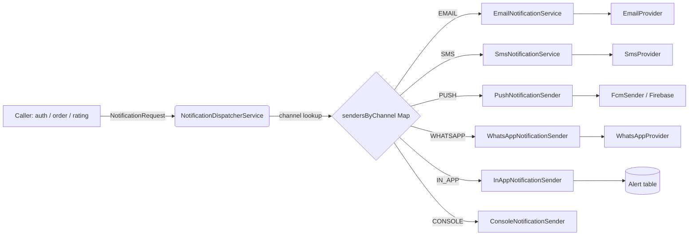
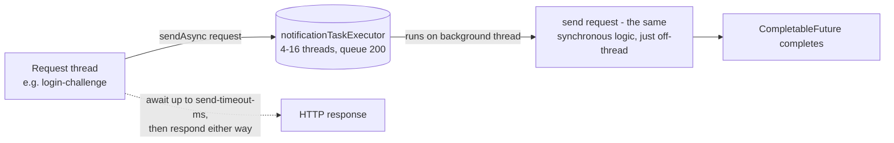
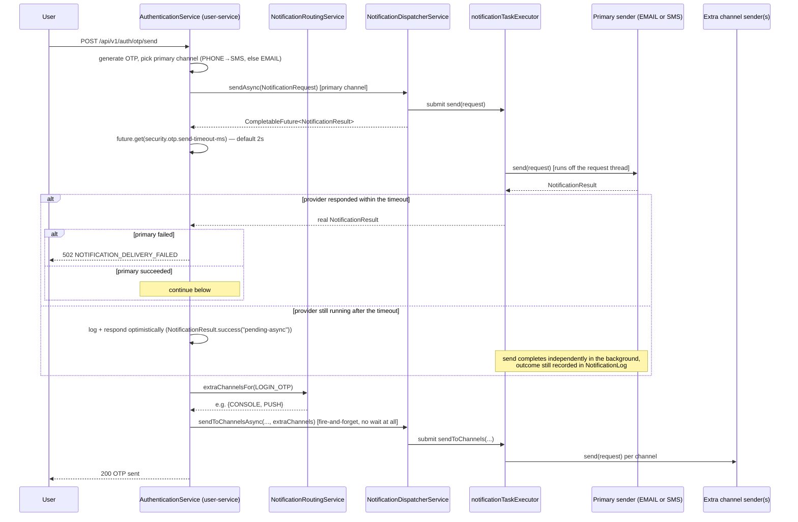
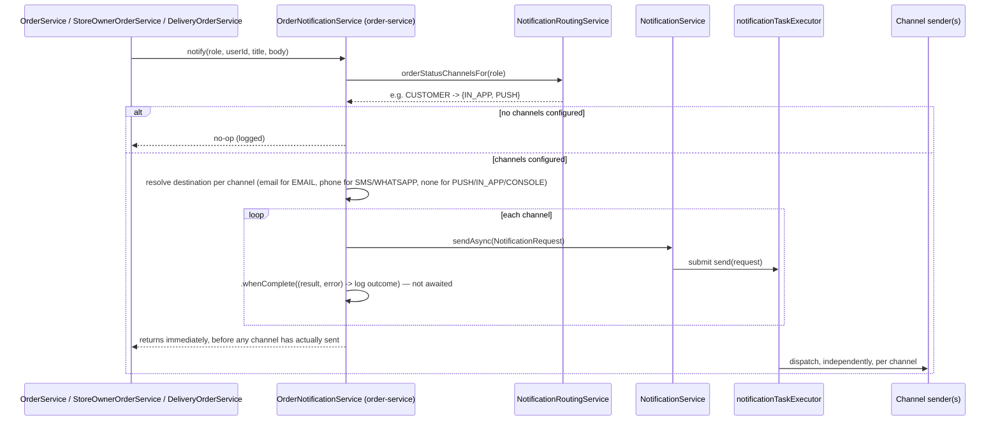

# pureeats-notification-service
https://claude.ai/code/artifact/8cfa3dce-272b-474c-9e65-28bfa246aac9

The single module every other service (auth, order, rating, ...) goes through to notify a user -
by email, SMS, push, WhatsApp, an in-app alert, or a console trace, on any combination of those at
once. No other module imports a mail sender, an SMS gateway SDK, or Firebase directly.

## Design principles

1. **Callers only ever see two interfaces**: [`NotificationService`](src/main/java/com/pureeats/notification/service/NotificationService.java)
   (send to one channel, or fan out to several) and [`ChannelNotificationSender`](src/main/java/com/pureeats/notification/service/ChannelNotificationSender.java)
   (one implementation per channel). Nothing outside this module imports `EmailProvider`,
   `SmsProvider`, `WhatsAppProvider`, `PushTokenRepository`, `JavaMailSender`, or the Firebase SDK.
2. **Provider swap = one new class + one `@Bean`.** `EmailNotificationService`/`SmsNotificationService`/
   `WhatsAppNotificationSender` each depend on a provider *interface*; which concrete provider is
   active is chosen purely by `@ConditionalOnProperty` in
   [`NotificationProviderConfig`](src/main/java/com/pureeats/notification/config/NotificationProviderConfig.java).
   Adding SendGrid, Twilio, or a real WhatsApp Business API integration never touches the sender
   classes or any caller.
3. **Channel fan-out, not one-channel-per-call.** A single logical notification (a login OTP, an
   order-status update) can go out on several channels at once - which ones is admin-configurable
   at runtime via [`NotificationRoutingService`](src/main/java/com/pureeats/notification/service/NotificationRoutingService.java),
   not hardcoded per call site.
4. **New channel = new enum constant + new sender**, nothing else. See [Adding a new channel](#adding-a-new-channel).
5. **The provider round-trip never runs on a request thread.** Every call site that fires from an
   HTTP request path uses [`NotificationService#sendAsync`](src/main/java/com/pureeats/notification/service/NotificationService.java)
   / `#sendToChannelsAsync`, which run on the module's own background pool
   ([`AsyncNotificationConfig`](src/main/java/com/pureeats/notification/config/AsyncNotificationConfig.java)).
   A slow SMTP relay adds to that pool's queue depth, never to the login/order-action response time.
   See [Async dispatch](#async-dispatch).

## Package layout

```
com.pureeats.notification
├── enums/            NotificationChannel, NotificationType, NotificationRecipientRole, NotificationStatus
├── dto/               NotificationRequest, NotificationResult, NotificationRoutingConfig, AlertResponse, SavePushTokenRequest
├── entity/            NotificationLog (delivery audit trail for EMAIL/SMS)
├── repository/        AlertRepository, PushTokenRepository, NotificationLogRepository, NotificationSettingRepository
├── provider/          EmailProvider, SmsProvider, WhatsAppProvider + their Console*/Smtp* implementations
├── template/          TemplateRenderer, SimpleTemplateRenderer, NotificationTemplateResolver
├── service/           ChannelNotificationSender + one impl per channel, NotificationDispatcherService,
│                      NotificationRoutingService, AlertService, PushTokenService, FcmSender
├── config/            NotificationProperties, NotificationProviderConfig, AsyncNotificationConfig
└── controller/        NotificationController (user-facing alerts/push-token), NotificationRoutingController (admin)
```

## Core types

| Type | Shape | Purpose |
|---|---|---|
| `NotificationChannel` | `EMAIL, SMS, PUSH, WHATSAPP, IN_APP, CONSOLE` | Every channel a notification can go out on |
| `NotificationType` | `LOGIN_OTP, SIGNUP_OTP, PASSWORD_RESET_OTP, EMAIL_VERIFICATION, PHONE_VERIFICATION, ORDER_STATUS_UPDATE` | Drives which template file is resolved |
| `NotificationRecipientRole` | `CUSTOMER, STORE_OWNER, DELIVERY_PARTNER, ADMIN` | Who an order-status notification is going to - the key the routing config is keyed by |
| `NotificationRequest` | `record(type, channel, destination, userId, params)` | The one shape every caller builds |
| `NotificationResult` | `record(success, providerMessageId, failureReason)` | The one shape every sender returns |

## Channel → sender → provider matrix

| Channel | Sender | Provider interface | Active implementation (default) | Config key |
|---|---|---|---|---|
| `EMAIL` | `EmailNotificationService` | `EmailProvider` | `SmtpEmailProvider` (or `ConsoleEmailProvider`) | `notification.email-provider` (`smtp`\|`console`) |
| `SMS` | `SmsNotificationService` | `SmsProvider` | `ConsoleSmsProvider` | `notification.sms-provider` (`console`) |
| `WHATSAPP` | `WhatsAppNotificationSender` | `WhatsAppProvider` | `ConsoleWhatsAppProvider` | `notification.whatsapp-provider` (`console`) |
| `PUSH` | `PushNotificationSender` | *(none - talks to `FcmSender` directly)* | Firebase Admin SDK, stub-safe with no credentials | `pureeats.fcm.credentials-path` |
| `IN_APP` | `InAppNotificationSender` | *(none - persists `Alert` directly)* | — | — |
| `CONSOLE` | `ConsoleNotificationSender` | *(none)* | Logs at INFO | — |

EMAIL/SMS/WHATSAPP render a template (`templates/{channel}/{type}.{txt|html}` with a generic
`otp.*` fallback for OTP-shaped types) via `TemplateRenderer` + `NotificationTemplateResolver`.
PUSH/IN_APP/CONSOLE use `params["title"]`/`params["body"]` directly - no template file, since that
copy is composed dynamically by the calling service (e.g. order-status wording).

## How a request gets dispatched



`NotificationDispatcherService` is built by Spring auto-collecting every
`ChannelNotificationSender` bean into a `Map<NotificationChannel, ChannelNotificationSender>` at
startup (`@PostConstruct`-free, done in the constructor) - a new channel sender registers itself
just by existing as a `@Service`.

## Async dispatch

`NotificationService` has two shapes of every send method:

| Method | Runs on | Use from |
|---|---|---|
| `send(request)` / `sendToChannels(...)` | the caller's own thread, blocks until the provider round-trip returns | background jobs, tests, anywhere already off the request thread |
| `sendAsync(request)` / `sendToChannelsAsync(...)` | `notificationTaskExecutor` (a dedicated pool, not Tomcat's request threads) | any HTTP-request-handling code path |

`sendAsync` returns a `CompletableFuture<NotificationResult>`; `sendToChannelsAsync` returns `void`
(fully fire-and-forget - each channel's own sender still logs its outcome, and EMAIL/SMS still
write a row to `NotificationLog`). The `@Async` annotation lives on
`NotificationDispatcherService`'s implementation, so it only takes effect when called through the
injected `NotificationService` bean (the Spring proxy) - calling it via `this.sendAsync(...)` from
inside that same class would bypass the proxy and execute synchronously, same as any other Spring
AOP method.



`AsyncNotificationConfig` sizes and names this pool (`notification.async.*`), sets
`CallerRunsPolicy` so a saturated queue degrades to synchronous-on-the-caller rather than dropping
a notification, and calls `setWaitForTasksToCompleteOnShutdown(true)` (with a bounded
`await-termination-seconds`) so a deploy/restart doesn't kill a notification that's mid-send.

## Flow 1: OTP notification (bounded-wait primary channel + fire-and-forget fan-out)



The primary channel (the one matching the destination type) still gates a hard failure - a
provider that responds within `security.otp.send-timeout-ms` and fails still returns 502, same as
before. What changed is that a *slow* provider (the common case with the current SMTP relay, which
often takes 4-6s) no longer holds the response hostage: past the timeout, the login flow responds
optimistically and the real send finishes on `notificationTaskExecutor`. Extra channels were
already best-effort; they're now also non-blocking, since `sendToChannelsAsync` doesn't wait at
all. Extra channels default to empty, so this only activates once an admin opts in via
`PUT /api/v1/admin/notification-routing`.

## Flow 2: Order-status notification (role-based, admin-configurable channels)



`OrderNotificationService` lives in **order-service**, not notification-service or pureeats-app -
order-service already depends on notification-service, catalog-service and user-service, so it can
resolve everything (routing config, channel senders, recipient's email/phone) without creating a
circular module dependency. The 8 order-lifecycle call sites (accept/cancel/assign-rider/deliver/
admin-override/new-order-to-owner) all go through this one method instead of hardcoding
"in-app alert + best-effort push" the way they used to. Every channel here is dispatched via
`sendAsync` with no bounded wait at all (unlike the OTP flow's primary channel) - an order-status
update was already a fire-and-forget side effect of the state transition, never something the
accept/cancel/deliver response itself depended on, so there's no reason to wait on any part of it.

## Admin-configurable routing (`NotificationRoutingConfig`)

Stored as one JSON blob in the shared `settings` key/value table (same pattern as catalog-service's
`AppConfigService`), key `notification_routing`:

```json
{
  "extraChannelsByNotificationType": {
    "LOGIN_OTP": ["CONSOLE", "PUSH"]
  },
  "orderStatusChannelsByRole": {
    "CUSTOMER": ["IN_APP", "PUSH"],
    "STORE_OWNER": ["IN_APP"],
    "DELIVERY_PARTNER": ["IN_APP", "PUSH"],
    "ADMIN": ["IN_APP"]
  }
}
```

- `GET /api/v1/admin/notification-routing` - read the current config.
- `PUT /api/v1/admin/notification-routing` - replace it (ADMIN/SUPER_ADMIN only, enforced by
  pureeats-app's central `SecurityConfig`, since this module has no direct spring-security
  dependency).

Unknown channel/role strings are ignored with a warning rather than failing the whole config, so a
typo or a since-renamed constant never bricks notification delivery.

## Adding a new channel

1. Add the constant to `NotificationChannel`.
2. Write a `ChannelNotificationSender` implementation (`@Service`), returning that channel from
   `channel()`. If it needs a swappable backend, add a provider interface + `@ConditionalOnProperty`
   bean(s) in `NotificationProviderConfig`, following the EMAIL/SMS/WHATSAPP shape.
3. Nothing else changes - `NotificationDispatcherService` picks it up automatically, and it becomes
   a valid value in `NotificationRoutingConfig` immediately.

## Adding a new email/SMS provider (e.g. SendGrid, Twilio)

1. Implement `EmailProvider` (or `SmsProvider`).
2. Add one `@Bean` method in `NotificationProviderConfig`, guarded by
   `@ConditionalOnProperty(prefix = "notification", name = "email-provider", havingValue = "sendgrid")`.
3. Set `notification.email-provider=sendgrid` (env var `NOTIFICATION_EMAIL_PROVIDER`). Nothing in
   `EmailNotificationService` or any caller changes.

## Related endpoints (user-facing)

| Method | Path | Purpose |
|---|---|---|
| `POST` | `/api/v1/notifications/push-token` | Register/refresh this device's FCM token |
| `GET` | `/api/v1/notifications` | List the signed-in user's recent alerts (7 days, max 20) |
| `PATCH` | `/api/v1/notifications/read-all` | Mark all as read |
| `PATCH` | `/api/v1/notifications/{id}/read` | Mark one as read |
| `DELETE` | `/api/v1/notifications/{id}` | Delete one |

## Configuration reference

| Key | Default | Notes |
|---|---|---|
| `notification.email-provider` | `console` | `smtp` \| `console` |
| `notification.sms-provider` | `console` | `console` today |
| `notification.whatsapp-provider` | `console` | `console` today |
| `notification.from-address` / `notification.from-name` | `no-reply@pureeats.local` / `PureEats` | SMTP sender identity |
| `pureeats.fcm.credentials-path` | *(unset)* | Path to a Firebase service-account JSON; unset = push logs only, never throws |
| `notification.async.core-pool-size` / `max-pool-size` / `queue-capacity` | `4` / `16` / `200` | Sizing for `notificationTaskExecutor` |
| `notification.async.await-termination-seconds` | `20` | How long shutdown waits for in-flight async sends before giving up |
| `security.otp.send-timeout-ms` | `2000` | How long `POST /api/v1/auth/otp/send` waits for the primary channel's real result before responding optimistically |

## Known limitations

- **Extra-channel fan-out reuses one `destination` string per request** (both for OTP and
  order-status). An EMAIL-primary OTP with an SMS/WHATSAPP extra channel configured would
  incorrectly target an email address as a phone number - `OrderNotificationService` resolves
  per-channel destinations correctly, but `AuthenticationService`'s OTP extra-channel fan-out does
  not yet. Flagged inline in both classes.
- **The optimistic-response path on OTP send trades a hard guarantee for latency.** If the primary
  channel takes longer than `security.otp.send-timeout-ms`, the caller is told "OTP sent" before
  delivery is actually confirmed. If it then fails in the background, the user is left waiting for
  a code that never arrives, with no error shown - the failure is only visible in `NotificationLog`
  and the application logs, not to the user. A resend still works either way, since it's an
  independent attempt.
- **No durable queue.** `notificationTaskExecutor` is in-memory - `setWaitForTasksToCompleteOnShutdown`
  gives in-flight sends a window to finish on a graceful shutdown, but a hard crash (OOM, `kill -9`,
  a host failure) between "kicked off" and "actually sent" loses that notification with no retry.

## See also

- [`docs/architecture.html`](docs/architecture.html) - the full designed reference page (this
  README's content, plus the class diagrams and both sequence flows, laid out for reading rather
  than grepping). Open it directly in a browser, no server needed.
- [`docs/dispatch-map.html`](docs/dispatch-map.html) - a single top-to-bottom schematic of every
  class, provider, and table in this module, from HTTP request to final delivery. The fastest way
  to see the whole system at a glance.
