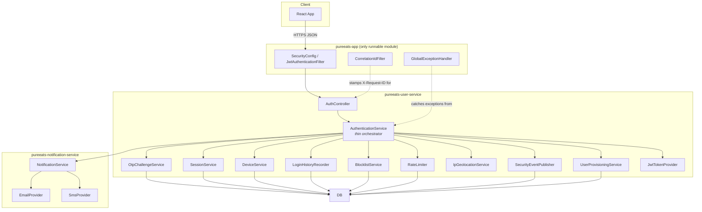
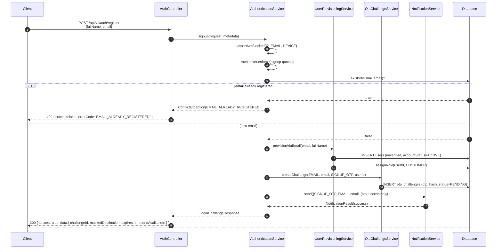
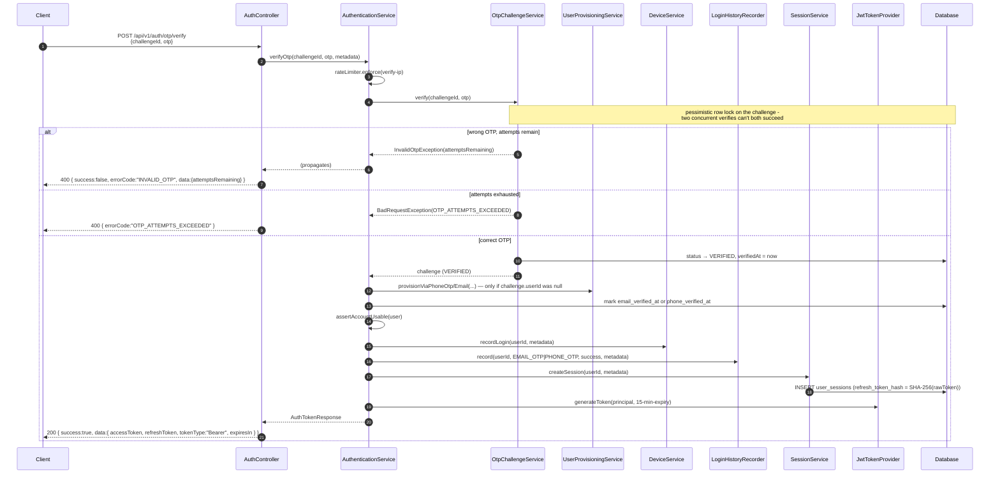
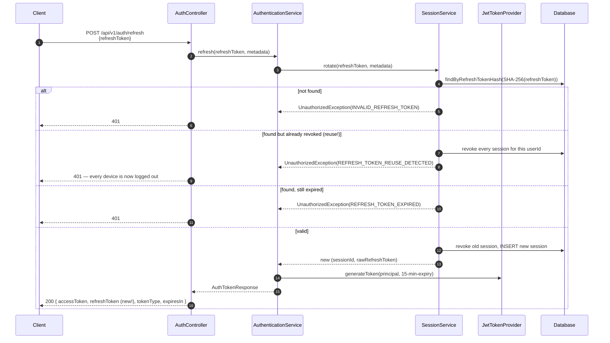
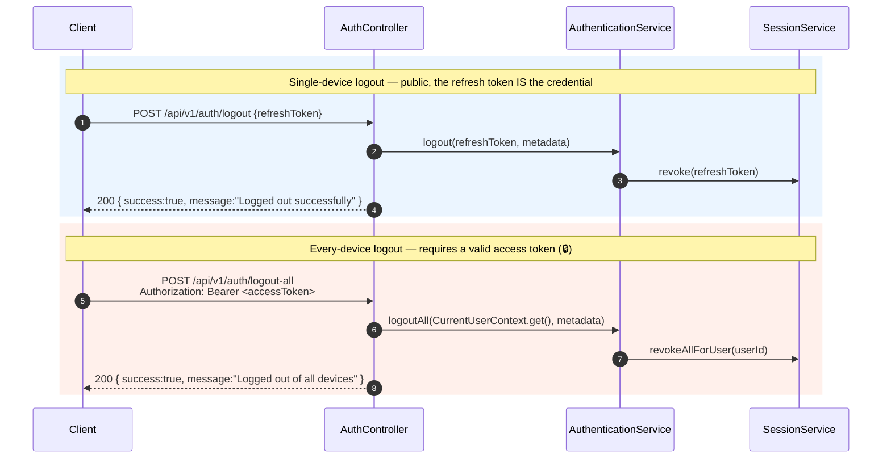
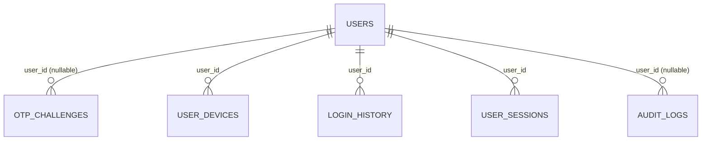

# PureEats — `pureeats-user-service`

Authentication, identity, and account security for PureEats. This module's primary responsibility
is the **OTP-challenge auth subsystem** — signup, phone/email OTP login, short-lived access
tokens, rotating refresh tokens, device/session tracking, rate limiting, blocklisting, and audit
logging. This README documents all of it from the inside: architecture, request/response
contracts, and the exact step-by-step sequence of what code runs for every call.

> **The password-login and 4-digit phone-OTP endpoints that used to exist here have been removed
> entirely** (not deprecated — deleted, along with `AuthService`, `OtpService`, the `SmsOtp`
> table, and their DTOs). OTP-challenge auth (this document) is now the only way to authenticate.
> One consequence worth knowing: `PasswordResetController`/`PasswordResetService` (email-based
> password reset) still exist and still work in isolation, but since nothing checks a password at
> login anymore, resetting one currently has no way to be *used* — see [Privileged roles](#privileged-roles-super_admin-and-admin)
> for the one place a password still matters (`SUPER_ADMIN`/`ADMIN` accounts, which log in via the
> email OTP flow, not their password).

> For deployment/config (Gmail SMTP setup, every environment variable, production
> recommendations), see **[AUTH_SECURITY.md](../AUTH_SECURITY.md)** at the repo root. This document
> is the engineering reference for the code that lives in *this* module.

## Table of contents

- [Architecture](#architecture)
- [Package map](#package-map)
- [SOLID, mapped to actual classes](#solid-mapped-to-actual-classes)
- [Complete authentication flows](#complete-authentication-flows)
  - [1. Sign up (email)](#1-sign-up-email)
  - [2. Log in with OTP (phone or email)](#2-log-in-with-otp-phone-or-email)
  - [3. Verify OTP → tokens](#3-verify-otp--tokens)
  - [4. Refresh an access token](#4-refresh-an-access-token)
  - [5. Logout / logout everywhere](#5-logout--logout-everywhere)
- [Step-by-step timeline: a full session](#step-by-step-timeline-a-full-session)
- [Privileged roles: SUPER_ADMIN and ADMIN](#privileged-roles-super_admin-and-admin)
- [API reference](#api-reference)
- [Error codes](#error-codes)
- [Data model](#data-model)
- [Admin audit endpoints](#admin-audit-endpoints)
- [Testing this module](#testing-this-module)

---

## Architecture



`AuthenticationService` is the **only** class the controller talks to for the OTP-challenge flow —
it never touches a repository or `HttpServletRequest` directly, and every collaborator above it is
a single-purpose class with one job. Nothing here is a "god service."

## Package map

| Package | Responsibility | Key classes |
|---|---|---|
| `controller` | HTTP surface only — no business logic | `AuthController` |
| `service` | Orchestration | `AuthenticationService` (the OTP-challenge flow), `UserProvisioningService`, `RoleService` (role resolution + the privileged-role registration guard), `SuperAdminSeeder` (startup-only, provisions the one `SUPER_ADMIN` account), `PasswordResetService` (legacy, email-based, independent of login) |
| `otp` | OTP generation, hashing, and the challenge lifecycle | `OtpGenerator` → `SecureOtpGenerator`, `OtpHasher` → `PasswordEncoderOtpHasher`, `OtpChallengeService` |
| `entity` | JPA entities used **only** by this module | `OtpChallenge`, `SecurityBlockEntry`, `UserDevice`, `LoginHistory`, `UserSession`, `AuditLog`, `RateLimitBucket` |
| `enums` | Enums used **only** by this module | `AuthenticationMethod`, `OtpChallengeStatus`, `BlockType`, `BlockStatus`, `LoginMethod`, `SecurityEventType` |
| `repository` | Spring Data JPA repositories | One per entity above, plus `UserRepository` |
| `security.blocklist` | IP/device/email/phone/user blocking | `BlocklistService` → `JpaBlocklistService` |
| `security.ratelimit` | Fixed-window, DB-backed rate limiting | `RateLimiter` → `DatabaseRateLimiter` (+ `RateLimitBucketStore` for atomic row creation) |
| `security.geolocation` | Best-effort IP → country/city | `IpGeolocationService` → `HttpIpGeolocationService` |
| `security.device` | Device fingerprinting + login history | `DeviceService`, `LoginHistoryRecorder` |
| `security.session` | Refresh-token issuance/rotation/revocation | `SessionService` |
| `security.audit` | Security/activity event log | `SecurityEvent`, `SecurityEventPublisher` → `AuditLogSecurityEventPublisher` |
| `security.metadata` | "Who/what is calling" per request | `RequestMetadata`, `RequestMetadataResolver`, `UserAgentParser` |
| `security` (root) | JWT issuance/validation | `JwtTokenProvider`, `JwtAuthenticationFilter`, `AuthenticatedUser` |
| `config` | Externalized settings | `AuthSecurityProperties` (`security.*`) |
| `dto` | Request/response records | `LoginChallengeRequest/Response`, `VerifyOtpRequest`, `AuthTokenResponse`, `ResendOtpRequest/Response`, `SignupRequest`, `RefreshTokenRequest`, `LogoutRequest`, plus the password-reset DTOs |

## SOLID, mapped to actual classes

| Principle | How it shows up here |
|---|---|
| **S**ingle responsibility | `OtpChallengeService` only manages OTP lifecycle state; it has never heard of `JwtTokenProvider`. `SessionService` only manages refresh tokens; it doesn't know what an OTP is. |
| **O**pen/closed | Adding a new `NotificationType` or `BlockType` value never requires touching `AuthenticationService`. Adding a new `EmailProvider`/`SmsProvider`/`IpGeolocationService`/`RateLimiter` implementation never requires touching a caller — swap the `@Bean`. |
| **L**iskov substitution | Every provider interface (`OtpGenerator`, `OtpHasher`, `EmailProvider`, `SmsProvider`, `IpGeolocationService`, `RateLimiter`, `BlocklistService`, `SecurityEventPublisher`) is called only through its interface type; any conforming implementation is a drop-in replacement (see `AUTH_SECURITY.md`'s swap table). |
| **I**nterface segregation | `ChannelNotificationSender` (notification-service) is a two-method interface, not a fat `NotificationService` with sender-specific methods bolted on. |
| **D**ependency inversion | `AuthenticationService` depends on `NotificationService`/`RateLimiter`/`BlocklistService`/`IpGeolocationService` interfaces, never on `SmtpEmailProvider`/`ConsoleSmsProvider`/`DatabaseRateLimiter` concrete classes. |

---

## Complete authentication flows

### 1. Sign up (email)



The user row exists (unverified) the moment signup succeeds — verification happens via the exact
same `/otp/verify` call as a login, which is what finally sets `email_verified_at`.

### 2. Log in with OTP (phone or email)

```mermaid
sequenceDiagram
    autonumber
    participant C as Client
    participant Ctrl as AuthController
    participant Auth as AuthenticationService
    participant Otp as OtpChallengeService
    participant Notif as NotificationService
    participant DB as Database

    C->>Ctrl: POST /api/v1/auth/otp/send<br/>{method, phone|email}
    Ctrl->>Auth: initiateLogin(request, metadata)
    Auth->>Auth: validate method-specific fields
    Auth->>Auth: assertNotBlocked(IP, PHONE|EMAIL, DEVICE)
    Auth->>Auth: rateLimiter.enforce(login-ip, login-destination, otp-request quotas)
    Auth->>DB: findByPhone/findByEmail(destination)
    alt account exists and is locked/blocked
        Auth-->>Ctrl: ForbiddenException(ACCOUNT_LOCKED/BLOCKED/...)
        Ctrl-->>C: 403 { success:false, errorCode }
    else proceeds (new or usable account)
        Auth->>Otp: createChallenge(method, destination, LOGIN_OTP, userId-or-null)
        Otp->>DB: INSERT otp_challenges
        Auth->>Notif: send({LOGIN_OTP, SMS|EMAIL, destination, {otp, ...}})
        Auth-->>Ctrl: LoginChallengeResponse
        Ctrl-->>C: 200 { success:true, data:{ challengeId, maskedDestination, expiresIn, resendAvailableIn } }
    end
```



A phone/email with **no existing account** gets a challenge too — the account is created silently
on successful verification (see below). This is deliberate: telling a client "no account exists"
before they've proven ownership of the phone/email is an account-enumeration leak.

### 3. Verify OTP → tokens



### 4. Refresh an access token



Refresh tokens **rotate on every use** — the token you just spent is dead the instant this call
succeeds. Presenting it again anywhere is treated as evidence of theft and nukes every session for
that user, not just the one that got reused.

### 5. Logout / logout everywhere



`logout-all` is the only endpoint in this whole flow that requires authentication — it's also the
only one that has no refresh token in its request to act on, so it needs the access token to know
*whose* sessions to revoke.

---

## Step-by-step timeline: a full session

A concrete walk-through, phone number `9876543210`, from "never seen before" to "logged out
everywhere" — every step names the exact class/method that runs.

| # | Client action | What happens server-side |
|---|---|---|
| 1 | `POST /otp/send` `{method:"PHONE", countryId:91, phone:"9876543210"}` | `AuthController.initiateOtpLogin` → `AuthenticationService.initiateLogin`: validates the PHONE-shape fields, checks `BlocklistService.isBlocked` for the IP/phone/device, calls `RateLimiter.enforce` four times (login-ip, login-destination, otp-requests-ip, otp-requests-destination), looks up `UserRepository.findByPhone` (not found — first time), then `OtpChallengeService.createChallenge(PHONE, "9876543210", LOGIN_OTP, null, metadata)` generates a 6-digit OTP via `SecureOtpGenerator`, hashes it via `PasswordEncoderOtpHasher` (BCrypt), and inserts an `otp_challenges` row (`status=PENDING`, `userId=null`). |
| 2 | *(server → notification)* | `AuthenticationService` builds a `NotificationRequest{LOGIN_OTP, SMS, "9876543210", {otp, expiryMinutes, userName:"there"}}` and calls `NotificationService.send(...)`. `NotificationDispatcherService` routes it to `SmsNotificationService`, which renders `templates/sms/otp.txt` and calls the configured `SmsProvider` (console by default). A `notification_logs` row records the attempt — **never** the OTP itself. |
| 3 | Client receives `200 { data: { challengeId: "c1a2...", maskedDestination: "******3210", expiresIn: 600, resendAvailableIn: 30 } }` | — |
| 4 | *(user mistypes)* `POST /otp/verify {challengeId:"c1a2...", otp:"000000"}` | `OtpChallengeService.verify` takes a pessimistic lock on the challenge row, compares the hash (no match), increments `attempt_count` to 1, computes `attemptsRemaining = maxAttempts(5) - 1 = 4`, and throws `InvalidOtpException`. This runs in its **own** transaction (`REQUIRES_NEW`) specifically so the attempt counter survives even though the call ends in an exception. |
| 5 | Client receives `400 { success:false, errorCode:"INVALID_OTP", data:{ attemptsRemaining: 4 } }` | — |
| 6 | `POST /otp/verify {challengeId:"c1a2...", otp:"<correct code>"}` | Hash matches → `status=VERIFIED`, `verifiedAt=now`. Back in `AuthenticationService.verifyOtp`: `challenge.userId` is `null`, so `UserProvisioningService.provisionViaPhoneOtp("9876543210", null)` creates the `User` row (placeholder email `9876543210@otp.pureeats.local`, `accountStatus=ACTIVE`) and assigns the `CUSTOMER` role via `RoleService`. `user.phoneVerifiedAt` is set. `AuthenticationService.assertAccountUsable` passes (brand new, `ACTIVE`). |
| 7 | *(bookkeeping)* | `DeviceService.recordLogin` upserts a `user_devices` row keyed by `(userId, deviceId)` (device id from the `X-Device-Id` header, or a derived fallback). `LoginHistoryRecorder.record` inserts a `login_history` row, best-effort enriched with `IpGeolocationService.resolve(ip)` (country/city — never exact location, and never blocks the login if the lookup fails/times out). `SecurityEventPublisher.publish` writes a `LOGIN_SUCCESS` row to `audit_logs` in its own transaction (survives even if something later in this request fails). |
| 8 | *(tokens)* | `SessionService.createSession` generates a 256-bit random refresh token, stores only its SHA-256 hash in a new `user_sessions` row (30-day expiry), and returns the raw token once. `JwtTokenProvider.generateToken(principal, 15-minute-expiry)` issues the access token. |
| 9 | Client receives `200 { data: { accessToken:"eyJ...", refreshToken:"Yt3q...", tokenType:"Bearer", expiresIn:900 } }` | The client now calls the rest of the API with `Authorization: Bearer <accessToken>`. |
| 10 | 15 minutes later, access token expires | `JwtAuthenticationFilter` rejects the expired token; the client calls `POST /refresh {refreshToken:"Yt3q..."}`. |
| 11 | `POST /refresh` | `SessionService.rotate`: finds the session by the token's hash, confirms it isn't revoked/expired, revokes it, and immediately creates a brand-new session (new refresh token). A fresh 15-minute access token is issued alongside it. |
| 12 | Client receives new `{ accessToken, refreshToken }` | The old refresh token (`Yt3q...`) is now dead. |
| 13 | *(compromise scenario)* Something replays the **old** `Yt3q...` token | `SessionService.rotate` finds the session, sees `revokedAt != null` (it was already rotated away in step 11), logs a warning, calls `revokeAllForUser` — **every** session this user has (including the legitimate new one from step 12) is revoked — and returns `401 REFRESH_TOKEN_REUSE_DETECTED`. The user has to log in again on every device, which is the intended "something's wrong, start clean" response to suspected token theft. |
| 14 | User taps "Log out" | `POST /logout {refreshToken:"<current>"}` → `SessionService.revoke` marks that one session revoked. Public endpoint — the refresh token itself proves the caller owns the session being revoked. |
| 15 | User taps "Log out everywhere" (from a settings screen, while still holding a valid access token) | `POST /logout-all` with `Authorization: Bearer <accessToken>` → `SecurityConfig` requires authentication for this one path specifically → `AuthenticationService.logoutAll(CurrentUserContext.get(), ...)` → `SessionService.revokeAllForUser` revokes every non-revoked session row for that user id in one query. |

---

## Privileged roles: `SUPER_ADMIN` and `ADMIN`

Both are provisioned **out-of-band** — never through `/register`:

- **`SUPER_ADMIN`** — exactly one account, created once on application startup by
  `SuperAdminSeeder` (an `ApplicationRunner`). On every boot it checks
  `RoleService.anyUserHasRole(SUPER_ADMIN)`; if that's `false`, it finds-or-creates the user
  configured by `SUPER_ADMIN_EMAIL`/`SUPER_ADMIN_NAME`/`SUPER_ADMIN_PASSWORD` (see the root
  `application.yml`) and assigns the role. The existence check is by **role assignment**, not by
  matching that email — so changing `SUPER_ADMIN_EMAIL` after the first boot renames nothing and
  never creates a second super admin; it's a strict "at most one, ever" invariant.
- **`ADMIN`** — no seeder, no self-serve path at all yet. Assign it directly in the database
  (`roles`/`model_has_roles`, `App\User` morph type) or through `RoleService.assignRole(userId,
  Role.ADMIN)` once an internal admin-panel endpoint exists to call it.

**Both roles are explicitly blocked from `/register`.** `RoleService.assertCallerNotPrivileged()`
runs as the very first line of `AuthenticationService.signup` (the handler behind `/register`):

```java
Long callerId = CurrentUserContext.get();      // null for a normal anonymous signup - the common case
if (callerId != null && roleService.resolveRole(callerId).isPrivileged()) {
    throw new ForbiddenException("REGISTRATION_BLOCKED_FOR_PRIVILEGED_ROLE", ...);
}
```

Two things worth being precise about:

1. **It only fires when the caller is already authenticated.** `/register` stays public
   (`permitAll` in `SecurityConfig`) — the check only has something to reject when a request
   happens to carry a valid `Authorization: Bearer` header for an admin/super-admin session. A
   normal anonymous signup is unaffected.
2. **The role is re-read from the database on every call, not trusted from the JWT's `role`
   claim.** `RoleService.resolveRole(callerId)` queries `model_has_roles` fresh each time. This
   matters: if an `ADMIN` were demoted mid-session, their still-unexpired JWT would *not* be able
   to bypass this guard, because the DB — not the token — is the source of truth here.

## API reference

Base path `/api/v1/auth`. Every response uses the standard envelope
`{ success, message, data, timestamp, errorCode, requestId }` (`ApiResponse`) — `errorCode`/
`requestId` are `null` on success. All new endpoints below are **public** except `/logout-all`.

### `POST /register`

<table>
<tr><th>Request</th><th>Success response <code>200</code></th></tr>
<tr><td>

```json
{
  "fullName": "John Doe",
  "email": "john@gmail.com"
}
```

</td><td>

```json
{
  "success": true,
  "message": "OK",
  "data": {
    "success": true,
    "message": "OTP sent successfully.",
    "challengeId": "886998e2-b2c6-4589-9619-28fe4effdfd5",
    "maskedDestination": "j**n@gmail.com",
    "expiresIn": 600,
    "resendAvailableIn": 30
  },
  "errorCode": null,
  "requestId": null,
  "timestamp": "2026-08-29T12:00:00Z"
}
```

</td></tr>
</table>

Errors: `409 EMAIL_ALREADY_REGISTERED`, `403 BLOCKED`, `429 RATE_LIMIT_EXCEEDED`.

### `POST /otp/send`

<table>
<tr><th>Request (phone)</th><th>Request (email)</th></tr>
<tr><td>

```json
{
  "method": "PHONE",
  "countryId": 1,
  "phone": "9876543210"
}
```

</td><td>

```json
{
  "method": "EMAIL",
  "email": "john@gmail.com"
}
```

</td></tr>
</table>

Success response: identical shape to `/register`'s `data`. Errors: `403 ACCOUNT_LOCKED` /
`ACCOUNT_BLOCKED` / `ACCOUNT_DISABLED` / `ACCOUNT_DEACTIVATED` / `BLOCKED`,
`429 RATE_LIMIT_EXCEEDED`, `400` (missing `countryId`/`phone`/`email` for the chosen method).

### `POST /otp/verify`

<table>
<tr><th>Request</th><th>Success response <code>200</code></th></tr>
<tr><td>

```json
{
  "challengeId": "886998e2-b2c6-4589-9619-28fe4effdfd5",
  "otp": "239843"
}
```

</td><td>

```json
{
  "success": true,
  "message": "Authentication successful.",
  "data": {
    "accessToken": "eyJhbGciOiJIUzM4NCJ9...",
    "refreshToken": "Yt3qX9f0P2m1...",
    "tokenType": "Bearer",
    "expiresIn": 900
  },
  "errorCode": null,
  "requestId": null,
  "timestamp": "2026-08-29T12:01:00Z"
}
```

</td></tr>
</table>

Error responses:

```json
// wrong OTP, attempts remain — 400
{ "success": false, "message": "The OTP entered is invalid or incorrect.",
  "data": { "attemptsRemaining": 2 }, "errorCode": "INVALID_OTP", "requestId": "..." }
```

```json
// attempts exhausted — 400
{ "success": false, "message": "Too many incorrect attempts. Please request a new OTP.",
  "data": null, "errorCode": "OTP_ATTEMPTS_EXCEEDED", "requestId": "..." }
```

Other codes: `400 OTP_EXPIRED`, `400 CHALLENGE_NOT_FOUND`, `400 ALREADY_VERIFIED`,
`403 ACCOUNT_LOCKED`/`ACCOUNT_BLOCKED`/`ACCOUNT_DISABLED`/`ACCOUNT_DEACTIVATED` (right OTP, unusable
account), `429 RATE_LIMIT_EXCEEDED`.

### `POST /otp/resend`

<table>
<tr><th>Request</th><th>Success response <code>200</code></th></tr>
<tr><td>

```json
{ "challengeId": "886998e2-b2c6-4589-9619-28fe4effdfd5" }
```

</td><td>

```json
{
  "success": true,
  "message": "OK",
  "data": {
    "success": true,
    "message": "A new OTP has been sent.",
    "expiresIn": 600,
    "resendAvailableIn": 30
  }
}
```

</td></tr>
</table>

Errors: `429 RESEND_COOLDOWN`, `429 MAX_RESENDS_EXCEEDED`, `400 ALREADY_VERIFIED`/
`CHALLENGE_CANCELLED`/`CHALLENGE_NOT_FOUND`.

### `POST /refresh`

<table>
<tr><th>Request</th><th>Success response <code>200</code></th></tr>
<tr><td>

```json
{ "refreshToken": "Yt3qX9f0P2m1..." }
```

</td><td>

```json
{
  "success": true,
  "message": "OK",
  "data": {
    "accessToken": "eyJhbGciOiJIUzM4NCJ9...",
    "refreshToken": "K7pL2wQrTz...",
    "tokenType": "Bearer",
    "expiresIn": 900
  }
}
```

</td></tr>
</table>

Errors: `401 INVALID_REFRESH_TOKEN`, `401 REFRESH_TOKEN_EXPIRED`,
`401 REFRESH_TOKEN_REUSE_DETECTED` (also revokes every session for the user).

### `POST /logout`

Request `{ "refreshToken": "..." }` → `200 { success:true, message:"Logged out successfully" }`.
Public — the refresh token itself is the credential proving session ownership.

### `POST /logout-all` 🔒

No body. Requires `Authorization: Bearer <accessToken>`.
→ `200 { success:true, message:"Logged out of all devices" }`.

---

## Error codes

| Code | HTTP | Meaning |
|---|---|---|
| `EMAIL_ALREADY_REGISTERED` | 409 | `/register` called with an email already in `users` |
| `REGISTRATION_BLOCKED_FOR_PRIVILEGED_ROLE` | 403 | caller is authenticated as `ADMIN`/`SUPER_ADMIN` and called `/register` |
| `BLOCKED` | 403 | IP/device/destination is on `security_blocklist` |
| `ACCOUNT_LOCKED` | 403 | `accountStatus=TEMPORARILY_LOCKED` and still within `lockedUntil` |
| `ACCOUNT_BLOCKED` | 403 | `accountStatus=BLOCKED` |
| `ACCOUNT_DISABLED` | 403 | `accountStatus=DISABLED` |
| `ACCOUNT_DEACTIVATED` | 403 | legacy `isActive="INACTIVE"` |
| `INVALID_OTP` | 400 | wrong code, attempts remain — see `data.attemptsRemaining` |
| `OTP_ATTEMPTS_EXCEEDED` | 400 | wrong code, no attempts left — challenge is now `LOCKED` |
| `OTP_EXPIRED` | 400 | past `expiresAt` |
| `CHALLENGE_NOT_FOUND` | 400 | unknown/garbage `challengeId` |
| `ALREADY_VERIFIED` | 400 | challenge already consumed |
| `CHALLENGE_CANCELLED` | 400 | challenge cancelled (reserved for future use) |
| `RESEND_COOLDOWN` | 429 | resent before `resendAvailableIn` elapsed |
| `MAX_RESENDS_EXCEEDED` | 429 | hit `security.otp.max-resends` for this challenge |
| `RATE_LIMIT_EXCEEDED` | 429 | generic — see message for which dimension |
| `INVALID_REFRESH_TOKEN` | 401 | no session matches this token's hash |
| `REFRESH_TOKEN_EXPIRED` | 401 | session found but past `expiresAt` |
| `REFRESH_TOKEN_REUSE_DETECTED` | 401 | token already rotated away once — every session for the user is revoked as a precaution |
| `NOTIFICATION_DELIVERY_FAILED` | 502 | the configured email/SMS provider failed to send |

---

## Data model

Full column-level DDL reference lives in [`AUTH_SECURITY.md` → Database
tables](../AUTH_SECURITY.md#database-tables). Quick shape:



`security_blocklist`, `rate_limit_buckets`, and `notification_logs` (the last lives in
`pureeats-notification-service`) don't reference `users` at all — they're keyed by
IP/device/destination or a bucket key, by design.

## Admin audit endpoints

Read-only, paginated observability over all seven security tables — `AdminAuditController`.
`ADMIN`/`SUPER_ADMIN` only, enforced **twice**, independently:

1. The pre-existing `SecurityConfig` URL rule — `/api/v1/admin/**` → `hasAnyRole("ADMIN", "SUPER_ADMIN")`.
2. A class-level `@PreAuthorize("hasAnyRole('ADMIN', 'SUPER_ADMIN')")` on the controller itself,
   which requires `@EnableMethodSecurity` (now on `pureeats-app`'s `SecurityConfig`). This is
   Spring Security's *method*-interception mechanism (AOP around the controller method) as
   opposed to the *URL*-pattern `SecurityFilterChain` mechanism everything else in this app uses —
   see the class Javadoc on `AdminAuditController` and `SecurityConfig` for why both are kept, and
   why this pattern isn't used in modules that don't already depend on Spring Security
   (catalog/order/rating) — that would undo the whole point of centralizing authorization.

| Endpoint | Entity | Filters | Notes |
|---|---|---|---|
| `GET /api/v1/admin/audit-logs` | `AuditLog` | `userId` | Every `SecurityEventType` |
| `GET /api/v1/admin/login-history` | `LoginHistory` | `userId` | Includes best-effort geolocation |
| `GET /api/v1/admin/otp-challenges` | `OtpChallenge` | `userId` | `maskedDestination`, never the OTP hash |
| `GET /api/v1/admin/rate-limit-buckets` | `RateLimitBucket` | — | Raw counters, mostly for debugging |
| `GET /api/v1/admin/security-blocklist` | `SecurityBlockEntry` | `blockType` | `value` shown unmasked — the point of this view is to see exactly what's blocked |
| `GET /api/v1/admin/user-devices` | `UserDevice` | `userId` | |
| `GET /api/v1/admin/user-sessions` | `UserSession` | `userId` | Never the refresh-token hash |

All seven are paginated (`page`/`size`/`sort` query params via Spring Data `Pageable`, default 20
per page, newest first) and wrapped in `PageResponse<T>` (`domain.common.response`) —
`{content, page, size, totalElements, totalPages}` — rather than a raw list, since these tables
are append-only and can grow large. Every response is a hand-written DTO, never the JPA entity;
`OtpChallengeResponse` and `UserSessionResponse` each have a one-line Javadoc explaining exactly
which field they deliberately omit and why.

These are read-only by design (an "audit" surface, not a management one). Two natural follow-ups
if you want them: a `POST /api/v1/admin/security-blocklist` to actually create a block
(`BlocklistService.block(...)` already exists and is unused by any endpoint), and a
`POST /api/v1/admin/user-sessions/{id}/revoke` for support/incident response
(`SessionService.revoke`/`revokeAllForUser` already exist too) — neither was in scope here.

## Testing this module

```bash
mvn -pl pureeats-user-service -am test
```

- `SecureOtpGeneratorTest` — length/charset/randomness of generated OTPs.
- `OtpChallengeServiceTest` — the full state machine: success, wrong-OTP attempt decrement,
  lock-after-max-attempts, already-locked, expired, unknown challenge, resend cooldown, resend
  limit, resend resetting attempts. Pure Mockito, no Spring context.

The end-to-end HTTP flow (this README's diagrams, executed for real against an H2 database) is
covered by `AuthFlowIntegrationTest` in `pureeats-app` — see
[AUTH_SECURITY.md → Testing](../AUTH_SECURITY.md#testing).
